# Dataset Production

## Methods experiments and systems for reliable training data

Revised research edition | 2 October 2026

A useful dataset is a measured, versioned claim about what a model should learn. Producing one requires more than collecting files or generating plausible answers. It requires a target definition, relevant coverage, trustworthy supervision, independent evaluation, and an export whose actual behavior has been checked.

This book teaches the methods behind that work: quality measurement, annotation, selection and mixtures, synthetic verification, modality-specific production, dataset debugging, public lab experiments, and production economics. Worked examples distinguish original calculations from published results. The main chapters are useful without any knowledge of Tuldok. A final application chapter explores how the methods could extend that image workbench, and a companion appendix preserves exact contracts for *Training Your Own Models on One 24 GB GPU*.

The book emphasizes decisions and tests rather than one universal recipe. It does not claim to exhaust every specialized field. Medical, legal, biometric, and other high-impact uses require additional domain-specific controls. Rights and permission discussions are operational cautions, not legal advice.

**How to read the evidence.** A published experiment supports its stated setup and metrics. A theoretical formula depends on its assumptions. A current tool card describes a version or edition, not proof of successful integration. Original worked examples are invented to teach a method. Proposed interfaces and schemas are design concepts. Unpublished lab details and untested runtime behavior remain unknown. Sources and tool status were checked on 2 October 2026.


## Contents

- 1 Define and measure the training claim
- 2 Annotation as a measurement process
- 3 Audit labels and estimate uncertainty
- 4 Sources permissions and lineage
- 5 Independence duplicates and contamination
- 6 Select the next useful examples
- 7 Mixtures curricula and data value
- 8 Generate verify and refine synthetic data
- 9 Vision capture simulation and temporal annotation
- 10 Audio segmentation alignment and diversity
- 11 Text retrieval preferences and tool environments
- 12 Debug data and test causal explanations
- 13 Reconstruct published production systems
- 14 Economics scale and maintenance
- 15 Freeze releases and test the emitted data
- 16 Apply the methods to Tuldok
- Appendix A Exact training companion contracts
- Appendix B Production tools and edition boundaries
- Appendix C Example schemas and export relationships
- Appendix D Worksheets and release review
- References and evidence notes


# 1 Define and measure the training claim

A photograph, a transcript, and a conversation log are source material. They become training examples only when someone specifies the input the model will receive, the target it should learn, the conditions under which that target is valid, and the experiment used to judge success. A dataset project begins by making those choices explicit.

Consider one photograph of a book. It might teach a classifier that the scene contains a book, a corner model where four named points lie, a segmenter which pixels represent visible paper, or an image generator the relationship between a caption and an image. These targets are related, but they are not interchangeable. A four-corner quadrilateral is not a pixel-perfect visible-object mask. A generation prompt is not a verified caption of its output. Reusing the source is economical; pretending the labels mean the same thing is dangerous.

A reliable platform therefore keeps the source asset, task-specific example, annotation revision, dataset release, and trainer export distinct. The same asset can support several tasks. A correction makes a new annotation revision. A release freezes specific revisions. An export adapts that frozen selection to the exact consumer without becoming the only surviving record of the data.

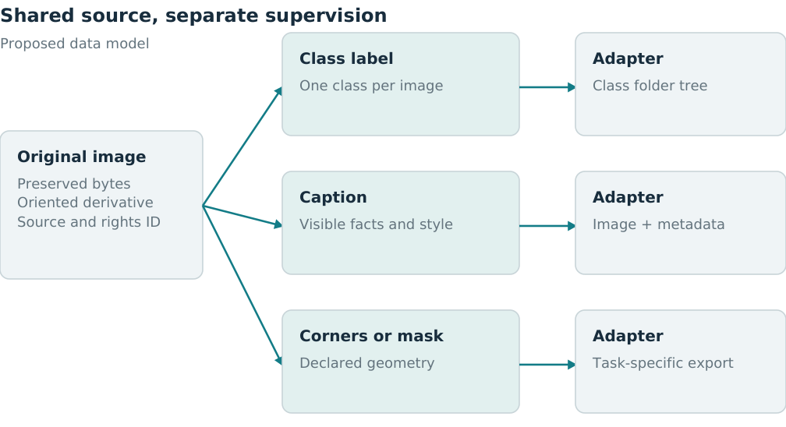

A dataset is simultaneously a record of observations, a measurement instrument, and a selection of the world. Those roles can fail separately. A perfectly decoded image may be irrelevant to deployment. A relevant image may have the wrong label. A correct label may answer the wrong question. A clean and relevant collection may still omit a rare condition on which the application depends.

This is why quality cannot be reduced to the percentage of rows passing a validator. Start with the intended use and the claim that will be evaluated. Then define a set of measurements that could reveal failure of that claim. Some are properties of records, some of the collection, some of the annotation process, and some can only be established by training and evaluating a model.

## Separate the target from its measurement

Suppose a project aims to teach helpful technical answers. A star rating is an observation; helpfulness is the intended construct. The rating may also respond to politeness, answer length, agreement with the reader, interface friction, or whether the reader understood the answer. A consistent rating system can therefore be consistently measuring the wrong thing.

The measurement-modeling framework of Jacobs and Wallach distinguishes the construct from its operationalization and separates reliability from validity. Repeated measurements can be stable while missing important aspects of the intended construct. Their analysis is a conceptual framework for making and testing assumptions, not an automatic validity test or a claim that one fairness metric settles competing values. [R01]

A practical specification should name the construct, the observable evidence, the measurement procedure, and its limitations. For a caption, factual support might mean that each object, count, attribute, and relation is visible in the image. For a preference, the construct might instead be which response a particular user population prefers under a stated task. For a tool trace, syntax validity, successful execution, correct final state, and authorization are distinct judgments. A single thumbs-up field cannot preserve all four.

The annotation guide is part of this instrument. So are the examples shown to reviewers, available zoom or playback controls, the order of candidates, the time budget, and the ability to choose uncertain. Changing these can change the observed labels even when the source material stays fixed. Version them when the change is likely to affect interpretation.

## A quality profile rather than one score

A useful profile asks seven different questions:

- **Integrity:** can the files be decoded, linked, and reproduced without corruption or missing references?
- **Target validity:** does the label actually express the intended task, including conventions for absence, uncertainty, and impossible cases?
- **Label fidelity:** how often does the accepted annotation disagree with qualified review or externally verifiable evidence?
- **Coverage:** which relevant conditions are represented, with how many independent families and how much uncertainty?
- **Independence and contamination:** are evaluation examples genuinely separated from training sources, derivatives, and the production process?
- **Usability and permitted use:** can the consumer interpret the representation, and is the intended processing or release allowed?
- **Downstream utility:** does a controlled change to the dataset improve the behavior that matters under the relevant constraints?

These axes do not necessarily move together. A stronger filter can increase average label fidelity while removing the very accents, unusual viewpoints, or difficult queries the model must learn. Duplicating a rare but useful example increases its training exposure without increasing independent coverage. Excluding uncertain cases can make agreement look better while changing the task into an easier, less representative problem.

Do not average these dimensions into a score unless the weights and tradeoffs have a clear decision meaning. An invalid license cannot generally be compensated for by a good caption, and a perfect schema cannot compensate for test leakage. Some dimensions are release constraints; others are quantities to optimize or report.

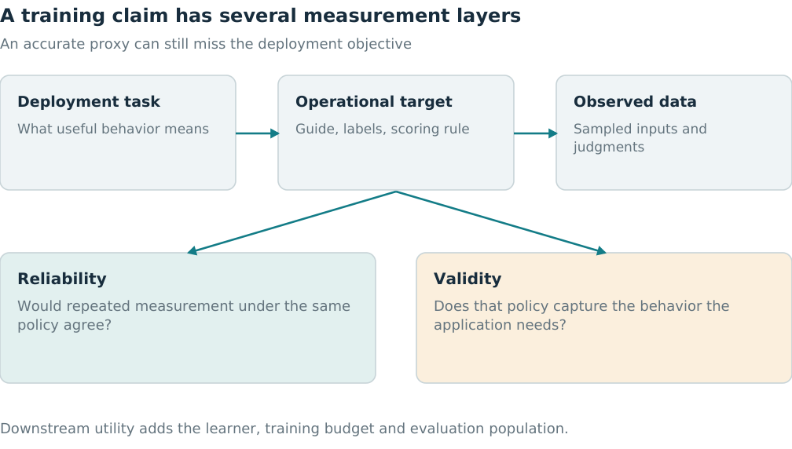

## Coverage depends on the deployment question

Coverage is not the same as uniformity. If ordinary daylight images account for 80 percent of expected use, equal counts of daylight and darkness do not estimate deployment performance without weighting. Yet darkness may deserve deliberate oversampling for training or review because it is difficult, costly when missed, or poorly understood.

Separate three distributions: the expected deployment distribution, the training selection or exposure distribution, and the evaluation sampling distribution. They can be intentionally different. The mistake is to treat a result under one as if it measured another.

A coverage worksheet can cross task-relevant factors such as scale, occlusion, lighting, device, source domain, language, speaker/session, ambiguity, or tool-error type. Record whether a cell is impossible, outside scope, merely unobserved, or present with few independent sources. The full Cartesian product may be enormous; prioritize plausible interactions and conditions connected to failure mechanisms.

For example, having both low-light images and partially occluded objects does not establish coverage of low-light partial occlusion. A model can perform well on each marginal slice and fail on their intersection. Conversely, filling every artificial combination can waste effort on unrealistic scenes. Coverage design combines domain knowledge, deployment observations, and targeted tests; it is not solved by a grid alone.

Unknown coverage should remain visible. A new camera, dialect, document format, or tool API can expose conditions not included in the original taxonomy. Reserve capacity for discovery through random sampling and open-ended error review rather than allowing the taxonomy to become a closed list of everything that can go wrong.

## Counts need a unit of independence

A thousand crops from ten recordings or scenes are not equivalent to a thousand independent recordings or scenes. Report rows, assets, families, tokens or hours, and repeated training exposures separately. Which family matters depends on the claim: source document, physical object, conversation, speaker, session, institution, time period, or synthetic scenario.

There is no universal conversion from rows to an effective sample size. Under a deliberately simplified model of equal groups of size m and within-group correlation rho, the familiar design-effect approximation is 1 + (m - 1)rho. With 1,000 observations in groups of five and rho=0.3, that factor is 2.2, giving an approximate effective size of 455 rather than 1,000. This is an illustration of dependence, not a replacement for analyzing the actual grouping structure.

For evaluation and uncertainty estimates, resample or hold out the meaningful independent units when possible. A bootstrap over individual frames from the same video can produce deceptively narrow intervals. Overlapping protected relationships may require connected components rather than choosing only one group ID. The cost is that truly independent test material can be much smaller than the file count suggests.

## Utility is conditional on the experiment

The utility of a dataset change is the difference it makes under a specified model, training procedure, budget, evaluation distribution, and metric. It is not an intrinsic permanent value attached to a row. A long document may help one tokenizer and context length but be truncated by another. A hard example may help after a model learns the basics and destabilize a much smaller model trained from scratch.

A clean experiment compares a baseline with a specific intervention: corrected labels, a new source, changed mixture weights, a new caption policy, or reviewed hard negatives. Hold the training budget and other settings constant where that answers the question. Also report an equal-data-size comparison when the intervention changes the number of rows. Equal epochs, equal tokens, equal steps, and equal compute answer different questions.

Measure regressions as well as gains. Average accuracy can improve while a rare critical slice deteriorates. For probabilistic decisions, evaluate calibration and the chosen operating threshold. For retrieval, inspect relevance and downstream support, not only similarity. For generative tasks, separate correctness, coverage, style, and failure severity. A statistically detectable gain can still be too small to justify a much more expensive pipeline.


# 2 Annotation as a measurement process

Annotation is not merely filling empty fields. It is the process that turns evidence and a task definition into a training target. The work can involve observation, expert interpretation, policy application, preference, or judgment under uncertainty. Those activities require different reviewer qualifications and different ways to interpret disagreement.

## Distinguish five causes of disagreement

A pair of conflicting annotations can result from an ordinary mistake, missing evidence, an unclear task definition, a legitimate boundary ambiguity, or a stable difference in perspective. These causes should not all receive the same repair.

If a transcript contains a word that was not spoken, replaying the clip may resolve an error. If a word is inaudible, inventing consensus creates false precision. If two mask annotators disagree about whether an occluded region should be filled, the guide may need an explicit visible-versus-amodal rule. If reviewers prefer different response styles under the same facts, a distribution of preferences may be a more faithful target than one supposedly objective answer.

An adjudication reason should therefore say what was resolved: evidence error, guide clarification, ontology problem, boundary convention, or application-specific choice among defensible views. Preserve the independent annotations before adjudication. Otherwise a later analyst cannot distinguish natural agreement from agreement produced by discussion or a senior reviewer's authority.

## Design a pilot that can expose the guide's weaknesses

A useful pilot contains typical examples, borderline examples, known counterexamples, and cases for which the proposed task has no valid answer. Ask reviewers to explain a small subset of choices and record what information or controls they wished they had. This is a test of the instrument, not a competition to maximize a score quickly.

Revise the guide with positive and negative examples, boundary cases, explicit abstention rules, and explanations of common confusions. Then repeat independent labeling on fresh material. If reviewers repeatedly need hidden background knowledge, either provide that evidence, narrow the task, or recruit the relevant expertise. A more elaborate interface cannot replace missing domain knowledge.

The production guide should specify the unit of annotation, label definitions, allowed multi-label or hierarchical relationships, coordinate or time conventions, normalization policy, use of external evidence, and what to do when information is insufficient. It should also define which fields are observations and which are judgments. In a tool trace, an observed API response is different from a reviewer's preferred next action.

## Match expertise to the decision

Generalist reviewers are useful for many observable features and broad usability judgments. Specialist review is needed where a decision depends on technical terminology, fine-grained taxonomy, domain policy, or subtle acoustic/visual evidence. The appropriate expert may be a practitioner or someone with relevant lived or linguistic knowledge, rather than a person with a generic credential.

Create escalation paths. A generalist can identify an uncertain technical term and route it to a specialist while still completing ordinary transcript cleanup. A mask reviewer can flag an ambiguous object class without being forced to guess. The goal is to use scarce expertise where it changes the result.

Do not evaluate reviewers solely by conformity to majority labels, especially on subjective tasks. A reviewer who identifies a systematic guide problem may initially disagree more often. Track error types, consistency on well-defined cases, and the relevance of expertise. Quality control should detect problems without making everyone imitate one annotator's mistakes.

## Agreement is useful but is not truth

Raw agreement is easy to explain: the fraction of comparable decisions that match. It is also sensitive to prevalence. Consider an invented 100-item binary task. Two reviewers agree on 90 negatives, disagree on the remaining ten, and never agree on a positive. Their raw agreement is 90 percent. Each reviewer uses the positive label five times, so the chance-agreement term from their marginal label rates is 0.05² + 0.95² = 0.905. Cohen's kappa is therefore (0.90 - 0.905)/(1 - 0.905), about -0.053.

The point is not that one coefficient reveals the whole truth. It is that a high match rate dominated by negatives can conceal a complete lack of shared positive identification. Show the contingency table, per-label behavior, sample composition, and uncertainty beside any summary coefficient.

Krippendorff's alpha expresses reliability as 1 minus observed disagreement divided by expected disagreement, with a declared distance function appropriate to the measurement scale. It can accommodate multiple annotators and missing ratings. The author's computational note distinguishes nominal, ordinal, interval, and other metrics; the choice of distance encodes what counts as a serious difference. This flexibility does not establish that the task definition is valid or that annotators are unbiased. [R02]

For geometry and time, category agreement is insufficient. Report boundary displacement or mask overlap with relevant tolerances, inspect missed instances, and distinguish segmentation from class assignment. For audio, a transcript can differ only in normalization or can contain a consequential name error; the guide determines which is being measured. For preferences, retain ties and criterion-specific disagreements instead of making every comparison a forced winner.

A coefficient should be accompanied by its calculation policy: which examples and annotators were included, treatment of missingness and abstention, weighting of labels or distances, and interval estimation. Thresholds copied from another field should not become universal pass/fail rules. A low-information sample with almost no variation cannot support the same conclusion as a diverse pilot.

## Preserve disagreement when it is part of the target

Davani, Díaz, and Prabhakaran studied multi-annotator modeling for subjective language tasks rather than collapsing every item into a majority label. Their shared model with annotator-specific outputs matched or exceeded the majority-vote baseline across seven tasks and provided uncertainty related to disagreement. The paper also identifies limits: sparse per-annotator data, computational scaling, privacy, and the risk of excluding minority perspectives by optimizing only majority agreement. This is evidence for preserving raw judgments where appropriate, not a requirement to model each reviewer in every project. [R03]

Three reasonable outputs can follow an annotation campaign: a single adjudicated target under an objective or operational convention; a distribution of legitimate responses; or an unresolved record that is excluded from a specific export while retained for task refinement. The choice should follow the training objective and application, not the convenience of a CSV label column.

# 3 Audit labels and estimate uncertainty

Error discovery and error-rate estimation are different jobs. A targeted queue tries to find as many important problems as possible. A statistical audit tries to estimate a defined population quantity. Combining them without tracking how items were selected produces misleading quality claims.

## Keep two review queues

The targeted queue can use model-label disagreement, low confidence, rare slices, inconsistent geometry, new sources, or failed checks. It is allowed to be deliberately unrepresentative. Report its yield as confirmed issues per reviewed candidate and the types of issues found.

The audit queue is sampled with known inclusion probabilities from a frozen population, such as all accepted examples in a release. It may be stratified to give rare but important categories enough observations. Preserve the sampling seed or selection record, population counts, reviewer process, and outcomes. Report which estimand the audit addresses: error per row, per independent family, per clip, per hour, or per decision.

Neither queue replaces the other. Random audits often spend time on ordinary correct data; that is part of what makes population estimation possible. Targeted review is efficient for repair but can miss confident systematic errors or entire regions that the model does not recognize as unusual.

## An original stratified audit example

Imagine a frozen release with 8,000 ordinary examples and 2,000 difficult-condition examples. To understand both groups, audit 200 randomly selected independent items from each. Qualified review finds 2 errors in the ordinary stratum and 12 in the difficult stratum.

The within-stratum estimates are 1 percent and 6 percent. Averaging all audited items gives 14/400 = 3.5 percent, but that overweights the deliberately oversampled difficult stratum. The estimated release-wide row error rate is 0.8 × 1 percent + 0.2 × 6 percent = 2 percent.

This estimate depends on correct population weights, random selection within strata, a trustworthy adjudication process, and the assumed independent unit. If the 200 difficult items are twenty crops from each of ten scenes, they do not supply 200 independent observations about new-scene errors. If a reviewer only inspects suspicious accepted records, the calculation no longer applies.

For planning, an approximate independent-binomial variance is the sum over strata of weight² × p(1-p)/n, with a finite-population correction when appropriate. In this example the uncorrected standard error is about 0.66 percentage points. A simple normal interval would be roughly 0.7 to 3.3 percent, but the small count of two errors in one stratum makes that approximation fragile. Use a suitable stratified interval or family-level resampling method for the actual report, and expose the counts so a reader can assess the evidence.

If the purpose is to estimate the fraction of families containing any error, sample and score families as the unit instead. That is a different estimand from average erroneous rows, and large families should not silently receive the same or different weight without an explicit choice.

## Zero observed errors does not prove zero risk

For n independent Bernoulli trials with zero failures, a one-sided 95 percent upper bound solves (1-p)^n = 0.05. With n=300, p is approximately 0.00994, or about 1 percent. This is the origin of the useful rule-of-three approximation 3/n.

The statement is bounded: under the stated sampling and independence assumptions, the evidence limits an overall failure probability. It does not establish a bound for every unmeasured slice, for a different deployment distribution, or for a correlated set of near-duplicates. A release can have zero failures in a random sample while containing a systematic rare defect absent from that sample.

Choose sample size from the decision you need to make. To have about a 95 percent chance of observing at least one error when the true independent error rate is 1 percent, solve 1-(1-0.01)^n >= 0.95, giving n=299. Detecting the existence of a problem is different from estimating its rate precisely or showing it lies below a release threshold.

## Model based label issue detection

Confident Learning uses out-of-sample class probabilities and observed labels to estimate a noisy-versus-latent-label joint distribution, then ranks or filters potential errors. Its class-specific thresholds differ from simply deleting every model-label mismatch. Its theory assumes a latent true class and a class-conditional noise process, with additional sufficient conditions for exact recovery. Model quality still affects the probabilities. The method is therefore a useful review prioritizer, not a guarantee that unusual examples are wrong. [R04]

A practical cross-fitting workflow divides training families into folds, fits a model without each fold, and records predictions only on that held-out fold. This reduces the chance that a model's memorization of a suspect label is mistaken for evidence that the label is correct. Keep preprocessing and grouping inside the fold discipline. A model that has seen a duplicate or sibling source has not provided the intended independent prediction.

Low assigned-label probability may indicate a label error, an underrepresented valid case, missing input evidence, domain shift, or an inadequate model. Review the source before deciding. Correcting the target, adding evidence, changing the ontology, preserving ambiguity, or retaining the hard example are all possible outcomes. Deletion is only one option.

## Evaluation labels deserve their own audit

Northcutt, Athalye, and Mueller used model-based nomination followed by five independent crowd judgments to inspect ten benchmark collections. They separated correctable, multi-label, neither-label, and non-agreement cases. Their reported error estimates are lower-bound-like because nomination can miss errors, and their corrections are not perfect. Importantly, the paper says overall model rankings were initially unchanged after correction/removal; the instability experiment increased the prevalence of originally mislabeled cases. That is not evidence that every published ranking reverses after ordinary cleaning. [R05]

Use such findings to motivate an evaluation audit, not to justify choosing whichever corrected labels favor a preferred model. Freeze an adjudication protocol, blind model identities when possible, log changes, and report performance against original and corrected versions where that comparison is relevant. If developers repeatedly inspect test failures and shape training from them, the set becomes part of development; a new independent test may be needed for a fresh claim.

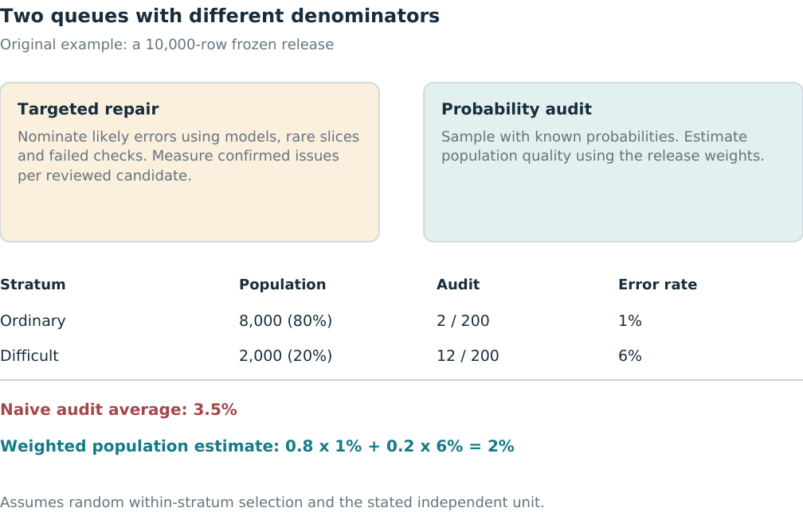

# 4 Sources permissions and lineage

## Permission is multidimensional

A source record should distinguish ownership or license evidence, allowed training, allowed transformations, external processing, redistribution, retention, and any restrictions on identifiable people or voices. Software licensing, source licensing, teacher-model licensing, endpoint terms, and the license of a released dataset answer different questions. An Apache-licensed tool does not grant permission to train on every photograph imported into it.

Use a rights state such as cleared_for_this_use, restricted, unresolved, or blocked, with the evidence and reviewer attached. A checked consent box records an assertion; it is not an independent legal determination. For a distributable release, unresolved material should remain excluded until the relevant use is resolved. For sensitive or contractual cases, obtain appropriate legal or organizational review rather than treating the workbench as legal advice.

External processing deserves a preview: which asset or excerpt will leave the machine, which provider receives it, what purpose it serves, and which permission record allows it. Credentials must remain outside dataset payloads, provenance logs, and exports.

## A compact canonical model

The following conceptual model can be implemented in a small database or a larger data platform. Stable IDs and clear relationships matter more than the storage brand.

| Object | Essential content | Relationship |
|---|---|---|
| Asset | Hash, modality, source locator, dimensions or duration | Original or derived from parents |
| Task contract | Input/target schema, ontology, guide, validation policy | Governs examples |
| Example revision | Input references, target, immutable revision ID | Uses assets under one task |
| Annotation event | Author or model, proposal/edit/accept/reject, guide version | Explains a revision |
| Verification run | Check/version, inputs, outcome, evidence | Supports or challenges a revision |
| Family relation | Typed source, object, speaker, session, scenario links | Constrains split assignment |
| Recipe run | Frozen inputs, parameters, versions, jobs, outcomes | Produces derived assets or proposals |
| Release | Selected revisions, hashes, splits, reports, versions | Freezes a dataset view |
| Export artifact | Release, adapter, consumer, layout, hashes, validation | Materializes training input |

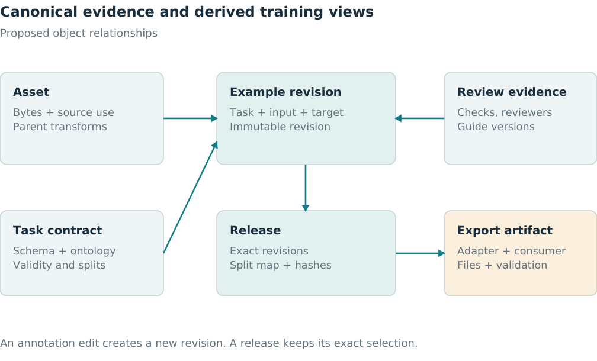

A review decision should not be inferred from a nonempty target. An asset should not duplicate itself because a second task uses it. An export must not silently overwrite source annotations with resized coordinates or tokenizer-rendered text. These are the invariants that make the model useful.

## Corrections and withdrawal

A source correction can invalidate descendants. The interface should preview which crops, captions, transcripts, examples, releases, indexes, and model runs depend on it. An ordinary label edit creates a revision and leaves old releases identifiable. A rights withdrawal is different: it may require deletion or restriction across retained bytes, caches, backups, exports, and indexes according to the applicable obligations.

Previously downloaded releases and trained weights do not disappear when a row is deleted. Mark affected releases and runs, revoke future distribution where possible, and identify retraining or other evaluated remediation for a deliberate decision. Keep only an appropriate minimal tombstone if needed to prevent accidental reintroduction. Do not retain unnecessary personal details under the banner of auditability.

Versioning also affects physical deletion. lakeFS documents that logical deletion and garbage collection are separate, with versions and branches potentially retaining reachable objects. The same issue exists in a local workbench with exported ZIPs and cached thumbnails. A withdrawal screen must explain the scope it can actually enforce. [R06]

# 5 Independence duplicates and contamination

## Choose the independence claim

Random rows are often the wrong split unit. A model trained on crops of an image should not be tested on another crop of that image if the claim is generalization to new scenes. Speaker-generalization requires unseen speakers; session robustness may require unseen recording conditions; retrieval evaluation may allow a known searchable corpus while holding query judgments out of training. State the claim first.

Store semantic split roles internally: training, model selection, calibration, and final test. An adapter maps these to the consumer's train, val, validation, dev, calibration, and test names. Calibration data must remain separate from fitting and model selection when the protocol calls for a held-out calibration stage. A convenient label named validation does not automatically satisfy both roles.

## Use connected families when constraints overlap

Suppose Book A appears in Sessions 1 and 2, while Book B also appears in Session 2. If both book and session independence are required, all these examples form one connected component. Assigning each book independently fails the session rule; assigning each session independently fails the book rule. Every protected edge must remain within one split.

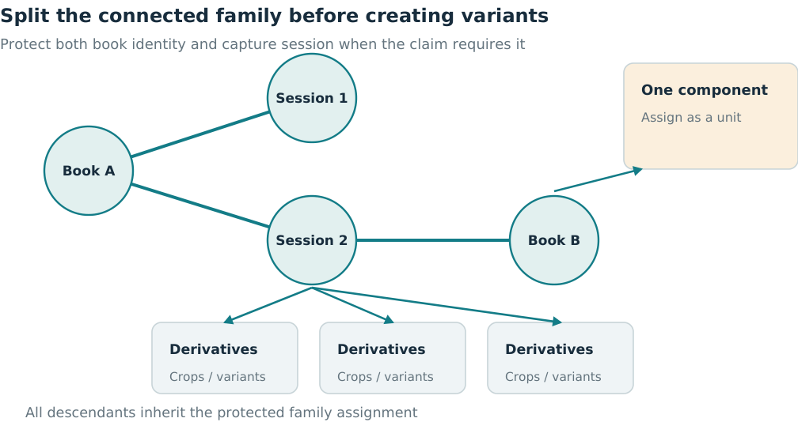

Compute protected components before crop expansion, paraphrase generation, conversation-turn expansion, or audio segmentation. Descendants inherit the assignment. Not every tag is a protected relation: a shared label like “English” must not merge the whole dataset. The task contract chooses which relationships matter.

A large component may make a requested 80/10/10 ratio impossible. Report the achieved allocation and coverage, or collect more independent groups. Never silently break the independence constraint to make a percentage look tidy. Split ratios should not hide a test set containing only a few true families.

## Deduplication needs several lenses

Raw-byte hashes catch identical files. Decoded-pixel or canonical-audio hashes catch some equivalent media encodings. Perceptual similarity catches transformed images; text shingles or MinHash catch lexical overlap; embedding similarity nominates semantic neighbors. Each method has different errors. Record the method, version, threshold, and decision.

A near-duplicate cluster is a review object, not an automatic delete command. Counterfactual examples can be nearly identical while legitimately having opposite labels. Retrieval positives may be paraphrases that must remain relevant. Rare classes can look deceptively similar. Reviewers need keep, remove, same_family, and related_but_distinct decisions with reasons.

Benchmark decontamination also requires judgment. Tülu 3 reports useful practical n-gram matching and warns that embedding matches can confuse general similarity with actual paraphrases. Combine exact/lexical checks, lineage, semantic nomination, and review. Record which benchmarks and versions were checked and which matches remain unresolved. [R07]

## Protect evaluation from the production process

Do not use final-test examples, seed documents, answers, or detailed evaluator feedback to generate training variants when claiming an untouched final test. Development data are where the recipe changes. If the test has become part of the iterative design loop, declare that limitation and establish a new independent test before making a fresh generalization claim.

This is broader than a filename overlap check. A generated question copied from a held-out document, a speech crop sharing a source recording, and a preference pair paraphrasing a final-test prompt can leak through different paths. The lineage graph and contamination report work together.

# 6 Select the next useful examples

The next useful example is not necessarily the next available file. A project can spend its budget collecting common easy cases, labeling an unlearnable ambiguity repeatedly, or generating variants of the same scenario while the important gap remains untouched. Selection methods make those choices explicit. Their value depends on the objective, the available pool, the current model, and the cost of obtaining a trustworthy target.

Distinguish acquisition, review, pruning, and sampling. Acquisition obtains a new source or label. Review checks an existing target. Pruning excludes material from a particular training view. Sampling changes how often retained examples are shown to the learner. None requires permanently deleting the canonical source, and each changes a different part of the production process.

## Begin with a baseline that can be beaten

Uniform random sampling is a serious baseline because it is simple, cheap, and resistant to a model's particular blind spots. Stratified random sampling adds minimum coverage for known domains or conditions. Compare a sophisticated selector with both where appropriate, at the same labeling and training budget.

The initial labeled set must let the model learn enough for its uncertainty or representation to be meaningful. A cold-start classifier trained on one narrow source may confidently misclassify a whole new source. No uncertainty rule can recover a missing category merely by trusting that classifier's confidence. A seed set should cover the known ontology and meaningful source families, and subsequent rounds should retain some exploration.

Count all costs. Scoring an enormous pool with a large teacher, retraining after every round, and tuning acquisition hyperparameters can consume the savings from fewer labels. A method that wins at a tiny annotation batch may lose operationally when expert review is only available in weekly batches.

## Uncertainty asks where the current model hesitates

Common acquisition scores include low maximum class probability, a small gap between the two leading classes, predictive entropy, and disagreement across a committee. These are related but different. A probability vector spread across many classes has high entropy; a two-way near tie has a small margin even if other classes are implausible.

Uncertainty is not the same as expected learning benefit. A permanently illegible word can remain uncertain after repeated review. An out-of-scope image can look unfamiliar without teaching the intended task. Conversely, a systematically wrong but overconfident model can assign low uncertainty to exactly the examples that need attention.

Committee disagreement can help identify model-dependent uncertainty, but the members need meaningful diversity. Different random seeds of the same architecture may share a blind spot; different model families may still share training data or a flawed guide. Use disagreement as a signal, then ask what evidence would resolve it.

An original thought experiment illustrates the problem. A pool contains 9,000 ordinary readable labels, 500 valid rare labels, and 500 permanently blurred labels. If the current model is uncertain about every blurred image but confidently wrong about the rare class, pure uncertainty sampling spends its first budget on the least repairable cases. A coverage quota and random exploration give the rare class a route into the labeled set. This is a constructed counterexample, not a claimed frequency in real projects.

## Diversity asks what the batch adds collectively

Selecting the top hundred uncertainty scores can produce a hundred nearly identical frames. Batch selection should account for redundancy, family relationships, and coverage. Even when every candidate is individually informative, their joint value can be small if they teach the same distinction.

The core-set approach of Sener and Savarese selects a batch to cover a representation space, using a k-center-style objective and a greedy approximation. The theoretical connection to loss uses assumptions including smoothness and low training error; the practical method relies on a chosen feature distance. It is therefore a principled coverage strategy in that space, not proof of complete semantic coverage. [R08]

A representation can organize the wrong factors. If embeddings group photos by background rather than the small object of interest, geometric coverage may miss the important variation. Very remote points can also be corrupt files or irrelevant outliers. Inspect selected representatives and compare with domain-based strata.

BADGE combines uncertainty and diversity through last-layer gradient embeddings computed using the model's current predicted label, then applies k-means++ seeding to choose a batch. The proxy label makes the calculation possible before annotation; it is not treated as a verified target. Its paper evaluates multiple architectures, datasets, and batch sizes, while the theoretical discussion does not establish universal optimality. [R09]

A practical batch can combine protected-family deduplication, minimum coverage, uncertainty or gradient scoring, and diversity within the remaining budget. Record the policy and inclusion probability where statistical estimation will later depend on selection. Do not let a visually pleasing embedding plot substitute for inspecting actual examples.

## Hard examples and hard negatives need verification

A hard example has high loss or poor performance relative to a particular model and objective. It may be valuable because it tests a subtle boundary, or harmful because its target is wrong. Increasing the weight of every high-loss example can amplify label errors and impossible tasks.

For retrieval, a hard negative is a nonrelevant candidate that the model ranks highly. High similarity alone does not establish nonrelevance. A passage can be another correct answer, a partial answer, a paraphrase of the positive, or a duplicate from the same source. Preserve multiple positives and uncertain judgments, and filter or review mined candidates before using them as negatives.

For classification and detection, review hard cases by failure type: lookalike classes, small or occluded objects, confusing backgrounds, empty scenes, and uncertain labels. A useful mining run specifies the model version, candidate pool, score, protected families, review policy, and the intended improvement. Re-mining after a model update creates a new selection because difficulty has changed.

The corrected version of *Deep Learning on a Data Diet* studies GraNd gradient norms and EL2N probability-error norms measured early in training. It shows useful pruning in studied vision settings but also finds that the highest-scoring examples can be undesirable, particularly with label noise. Crucially, the 2023 revision explicitly retracts the original initialization-time GraNd conclusion after a software bug was identified. A reproducibility study retained support for later-training signals while failing to reproduce initialization-time pruning. [R10] [R11]

The production lesson is broader than one algorithm: preserve the scoring checkpoint, implementation version, seeds, and comparison baseline. A published score name is not enough to reproduce the selection. Extreme pruning can remove entire useful subpopulations even when the remaining examples look individually challenging.

## Selection for evaluation is a different problem

Active learning chooses labels to improve a model. Active testing chooses labels to estimate a fixed model's risk efficiently. Kossen and colleagues derive acquisition strategies and a bias-corrected estimator for the latter. Their experiments also show that naive predictive-entropy selection can perform worse than random acquisition for an overconfident conventional network, while a better surrogate helps. [R12]

This reinforces the two-queue distinction from the audit chapter. Selecting difficult evaluation points and averaging their errors without the appropriate weighting estimates the selected queue, not the population. If the acquisition policy changes adaptively, use an estimator designed for that sampling process and retain the required probabilities. Otherwise prefer a simpler auditable random or stratified design.

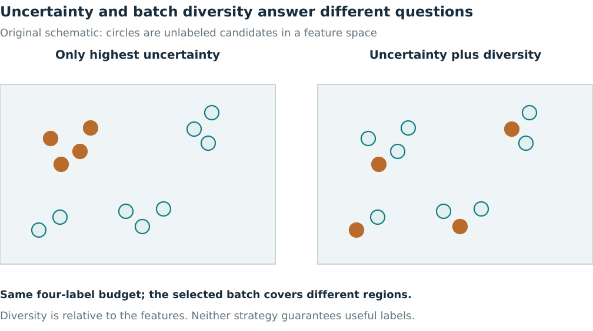

# 7 Mixtures curricula and data value

A dataset release identifies what may be used. A training mixture specifies how much each component contributes, and a curriculum specifies how that contribution changes over time. The distinction is especially important for language models, where a small source can be repeated many times and long targets can dominate a token-normalized objective.

## Decide what the mixture weights count

Weights can refer to examples, tokens, supervised target tokens, audio seconds, source families, or batches. These are not interchangeable. State the sampling unit and loss normalization.

Consider two invented SFT sources. Source A contains 10,000 examples with 20 supervised target tokens each; source B contains 1,000 examples with 400 target tokens each. A has ten times as many rows, but B contains twice as many target tokens. Sampling equal numbers of A and B examples gives B roughly 95 percent of supervised tokens if lengths remain fixed and the objective averages all target tokens together. Per-example loss normalization would create a different weighting. Context-only tokens affect compute without necessarily receiving loss.

For an illustrative pretraining budget of 100 million tokens, assigning half the budget to a 10-million-token source gives approximately five corpus-equivalent exposures. Assigning the other half to a one-million-token source gives fifty. Both sources have the same mixture weight, but very different repetition. Report unique material and exposure separately.

Tokenization, chunking, packing, truncation, deduplication, and target masking can change these quantities. A mixture manifest should record the recipe that produced them. A nominal 20 percent source weight is not reproducible if the sampling unit is left implicit.

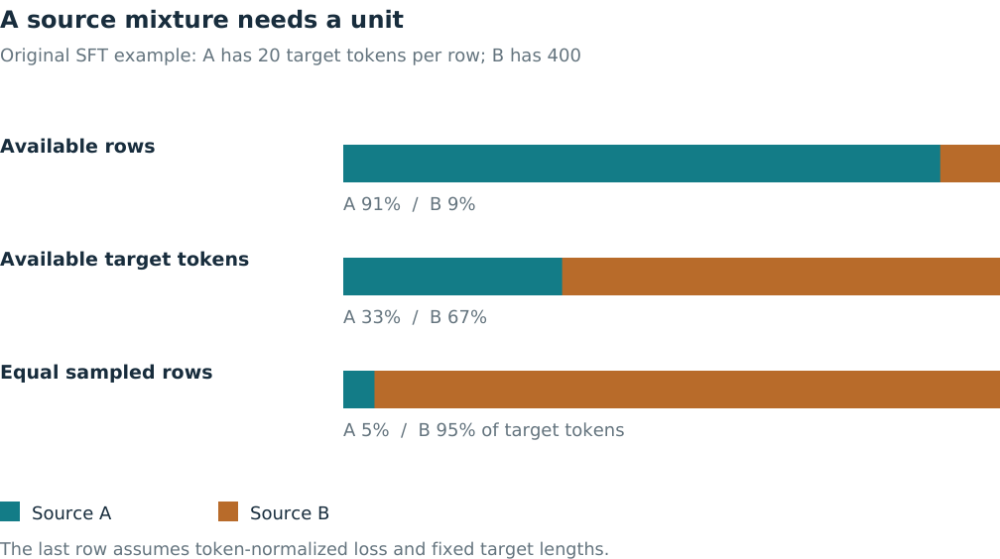

## Compare source balance against the actual objective

Some projects optimize an overall deployment-weighted metric. Others need minimum capability across domains, rare-slice protection, or a particular specialty. These objectives imply different mixtures. A source that contributes little to average accuracy may be essential to a required skill.

Begin with a transparent baseline, then vary a small number of weights or components under a fixed budget. Include a no-new-source baseline and an equal-token random alternative where useful. Use development evaluation for selection and reserve independent confirmation. A large search over mixtures can overfit the benchmark even without copying its examples.

A smaller proxy model can make experiments affordable, but its preferred mixture may not transfer to the final architecture, scale, tokenizer, or training horizon. Validate transfer on a limited final-model run rather than assume a universally correct recipe.

DoReMi is an instructive published method. It trains a small reference, uses a proxy with domain-wise excess loss relative to that reference, averages the resulting domain weights, then trains the main model on the resampled mixture. In the reported Pile setup, 280M-scale reference/proxy models guided an 8B model; average downstream accuracy improved by 6.5 percentage points and the baseline accuracy was reached in 2.6 times fewer main-training steps. Weight optimization itself cost additional compute, reported as 8 percent of the large-model run. Reference choice, domain definitions, and scale transfer remain limitations. [R13]

The important distinction is between difficulty and learnable headroom. A domain with high raw loss may contain noise or intrinsically unpredictable text, while a domain with large excess loss relative to a capable reference may offer more learnable improvement. A reference model is itself an assumption, so its weaknesses can shape the resulting weights.

## Repetition is neither automatically wasteful nor equivalent to new data

Repeated examples can continue to improve optimization, especially when unique material is scarce. They do not add new independent coverage, and returns can diminish or turn into overfitting. Monitor training-versus-held-out behavior, memorization risk, and per-source repetition.

Muennighoff and colleagues study data-constrained language modeling across hundreds of runs and fit a scaling relation that treats repeated tokens differently from fresh tokens. In their studied settings, up to roughly four epochs had little degradation relative to unique-data alternatives at fixed compute, but additional repetition had diminishing returns. Their appendix notes that repeating only part of a mixture is a separate setting. This is evidence against both “never repeat” and “every repeated token is as valuable as a new one,” not a universal four-epoch rule. [R14]

For a small specialist corpus, compare collecting new independent sources, improving labels, changing the model size, and training for more epochs. These options spend different resources. A large repeated dataset can still be narrow if every example descends from a few templates or documents.

## A curriculum changes the path through the data

The early curriculum-learning formulation treats training as a sequence of reweighted distributions that gradually approaches the target distribution. Its motivation is to make optimization easier before introducing greater complexity. Later work separates the scoring function for difficulty from the pacing function that determines how quickly examples enter training. [R15] [R16]

A curriculum might begin with clean short utterances before introducing overlap and noise, or with simple tool calls before multi-step error recovery. But easy-to-hard is a hypothesis. Difficulty can mean input complexity, model loss, teacher success rate, or human effort, and these can disagree.

To test ordering itself, compare schedules with matched total exposure where feasible. If the curriculum sees easy examples ten times and hard examples once while the baseline sees both equally, a gain could be due to weighting rather than order. Record both. Ensure the final phase actually covers the intended task and does not permanently omit hard but necessary conditions.

A self-paced rule based on current loss can reduce early noise but also avoid rare valid examples the model has not yet learned. A hard-first schedule can focus learning but fail before basic representations form. Keep development curves by slice and inspect which examples are being admitted or excluded over time.

## Data value is a conditional attribution

Data Shapley defines value through a learning algorithm and performance function, averaging an example's marginal contribution over subsets or permutations. The original work develops Monte Carlo and other approximations because exact computation is expensive. The value therefore depends on the chosen learner, utility, reference population, and approximation, rather than being an inherent price of the data. [R17]

An original two-record example makes the distinction from leave-one-out clear. Suppose records A and B are perfect substitutes: either alone produces utility 1, both together still produce 1, and no data produces 0. Removing A from the full set changes nothing, and removing B changes nothing. Leave-one-out assigns each a zero marginal effect. Averaging over the two possible arrival orders gives each Shapley value 0.5: the first contributes 1 and the second 0.

This is a useful explanation of redundancy, not a complete compensation policy. A different utility metric or grouping of duplicate records changes the problem. Complementary examples can also be valuable together despite weak individual gains. Training randomness and noisy evaluation make small estimated values unstable.

Use value estimates to prioritize a bounded experiment: inspect low-value regions, acquire more of a promising source, or test a proposed removal. Compare against simple cost and coverage baselines. Do not permanently erase a rare source or infer legal, ethical, or financial worth from one model-dependent score.

## A practical selection experiment

Freeze the candidate pool and protected family rules. Choose one question, such as whether reviewed hard negatives improve real-query retrieval under the available annotation budget. Compare random or stratified acquisition with the proposed selector using the same number of reviewed labels, and account for scoring and retraining cost.

Track accepted labels, unresolved cases, independent families, coverage shifts, and downstream results. A selector that requests many ambiguous examples may use the same number of reviewer actions but produce fewer usable targets. Repeat across acquisition seeds when possible and report the complete learning curve rather than only the most favorable budget point.

Stop or revise when the evidence shows diminishing useful returns, a bottleneck has moved, or the selector is reinforcing a blind spot. Selection is an adaptive production decision; it should remain inspectable and reversible through versioned views rather than become an invisible filter that defines the dataset forever.


# 8 Generate verify and refine synthetic data

Synthetic data can change inputs, targets, or both. A real image with a generated caption is a different intervention from a rendered image with a simulator mask. A human question with a teacher answer differs from a fully invented conversation. A programmatically checked tool rollout differs from a plausible but simulated transcript. Record these distinctions before comparing methods or choosing a mixture.

The productive question is not whether synthetic data is good in general. It is what missing supervision the process supplies, how its target is checked, which distribution it covers, and whether the resulting model improves on independent tasks. A generator is a candidate producer; the rest of the pipeline establishes what those candidates are allowed to mean.

## Match the generation strategy to the gap

**Grounded transformation** starts from authorized evidence and changes its representation: extract a question from a manual, rewrite a response under a style guide, translate a passage, recaption an image, or create a noisy audio derivative. The main advantage is a source against which to check the result. The main risk is assuming that the transformation preserves the target. A crop can remove the object, a paraphrase can reverse a condition, and an audio trim can invalidate the transcript.

**Seed expansion** uses a small set of tasks or examples to propose new instructions and instances. It is useful when the desired behavior can be demonstrated but is expensive to write at scale. The seed set shapes the task distribution, and recursive use of generated seeds can amplify narrow patterns. Preserve seed ancestry and reserve independent evaluation families before expansion.

Self-Instruct is an informative early case. It bootstrapped 175 manually written seed tasks into roughly 52,000 instructions and 82,000 instances, using separate instruction and instance generation plus heuristic filtering. For classification tasks, generating inputs first tended to favor one label, so the authors also generated labels first and conditioned inputs on them. In a 200-instance author audit, 92 percent of instructions were valid but only 54 percent had all fields valid. Useful downstream instruction learning coexisted with substantial record-level noise. [R18]

**Controlled evolution** increases or changes requirements: add a constraint, make a scenario more concrete, introduce another reasoning step, or vary the skill. Evol-Instruct distinguishes deeper transformations from broader topic/skill expansion and filters failed evolutions. This offers explicit variation controls, but a longer or more constrained instruction is not automatically a better example. The transformed task still needs to be coherent, solvable, relevant, and correctly answered. [R19]

**Model-prior sampling** draws tasks from an aligned model's learned instruction distribution. Magpie uses the model's chat-template prefix to elicit an instruction, then generates a response. It reduces dependence on hand-written seed questions, but the resulting diversity is still shaped by the teacher, template, sampling, and filters. An embedding plot or teacher-assigned quality label is evidence about those measurements, not an independent proof of truth or deployment coverage. [R20]

**Factorized generation** first samples a structured scenario: object count, lighting, ambiguity, tool state, language, or constraint combination. A renderer, program, or model then realizes the scenario. The advantage is controllable coverage and sometimes a known target. The risk is that requested factors differ from realized ones or create impossible combinations. Store both the scenario specification and the verified properties of the output.

**Environment-backed rollout** generates actions in a controlled executable environment and records observations and state transitions. This is especially useful for tools, code, and bounded decisions. It can provide stronger outcome evidence than an invented transcript, but only for the implemented environment and tests. A successful mock transaction is not proof that the same sequence would work on a changed production service.

## Separate the teacher's jobs

One model can propose tasks, answer them, critique answers, score them, and label difficulty. That is convenient, but it makes the evidence channels highly dependent. A teacher may be especially persuasive when defending its own mistake.

Assign roles explicitly: generator, grounder, verifier, judge, refiner, and reviewer. Independence can come from a different model, different evidence, a deterministic specification, execution, or a human expert. A different model name alone does not establish independence, and two prompts to the same model are not independent votes.

Ensembles can broaden candidate styles and expose disagreement. They also increase cost and can share systematic errors. Decide whether disagreement triggers rejection, another evidence check, or human review. Do not hide it by taking a majority without asking whether the task has a single verifiable target.

For a factual answer, attach the source span and check each material claim. For code, run tests that were not all invented together with the answer. For a caption, compare with the actual pixels. For speech, listen to the exact segment. For a preference, state the rubric and population whose judgment is being approximated. The verification method should match the intended claim.

## A verifier changes the composition of the dataset

Consider an original illustrative batch in which 60 percent of candidate answers are correct under a well-defined binary criterion. A verifier accepts 95 percent of correct answers and incorrectly accepts 10 percent of wrong answers. Out of 10,000 candidates, it accepts 5,700 correct answers and 400 wrong answers. The accepted set is therefore about 93.4 percent correct, with an overall acceptance rate of 61 percent.

This calculation is Bayes' rule expressed as a production funnel. Accepted precision equals the correctly accepted mass divided by all accepted mass. A verifier's false-accept rate is not the same as the error rate of the accepted dataset, because the latter also depends on the generator's starting quality.

Now add a second verifier with the same operating characteristics. If the two verifiers are conditionally independent given correctness, both accept 60 percent × 0.95² of the original candidates correctly and 40 percent × 0.10² incorrectly. Accepted precision rises to about 99.3 percent. But if both verifiers pass exactly the same incorrect subset, the hoped-for squared false-accept reduction does not occur. Correlated errors can make an impressive-looking two-judge gate little better than one.

These numbers are constructed, not measured capabilities of any model. Real tasks may have graded correctness, ambiguous targets, and slice-dependent rates. Estimate verifier behavior against qualified review on representative and difficult cases, then audit the final accepted distribution. A filter can also reject useful rare examples disproportionately, so measure false rejection and coverage loss.

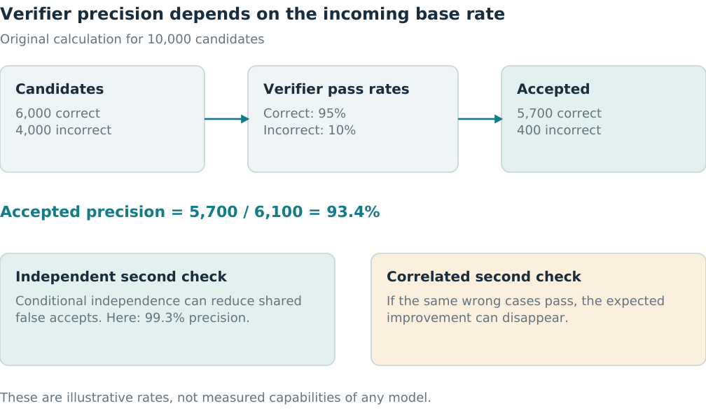

## Use several levels of verification

A schema validator can establish that required fields exist and types are correct. A consistency check can establish that an option ID exists or a mask aligns with its image. A semantic check can assess whether a claim follows from provided evidence. An executable check can test behavior or final state. A human review can interpret cases the other checks do not resolve.

These levels should remain separately visible. Passing JSON Schema does not establish factual correctness. A unit-test pass does not establish coverage of every edge case. A correct final answer does not prove every reasoning step is valid. A human accepting an AI suggestion does not become independent double annotation unless the workflow actually obtained independent judgments.

For executable tasks, version the environment, dependencies, initial state, test suite, time and resource limits, randomness, and observed outputs. Preserve failed executions and their reasons. Distinguish invalid candidate, environment failure, timeout, missing dependency, and nondeterministic outcome. A flaky verifier can corrupt labels if every infrastructure error is interpreted as model failure.

Use adversarial fixtures for the verifier itself. A tool argument can be schema-valid but reference a nonexistent item. A program can hard-code visible test outputs. A caption can mention the requested object even when the image omitted it. A reasoning answer can reach the right number by invalid steps. Verification needs tests of its own failure modes.

## Process labels and outcome labels answer different questions

Outcome supervision judges the result. Process supervision judges intermediate decisions or steps. The appropriate granularity depends on whether intermediate behavior matters and whether it can be judged reliably.

*Let's Verify Step by Step* collected positive, negative, and neutral judgments on model-generated mathematical steps, including 800,000 step labels across 75,000 solutions. It deliberately stopped process labeling at the first incorrect step and prioritized convincing wrong-answer solutions. Its large-scale process/outcome comparison used different training collections, so the authors also used smaller controlled comparisons. Evaluation selected among a fixed generator's solutions; it was not a study of improving that generator through RL. [R21]

The lesson is to preserve what the label measures. A step-quality label, a final-answer check, and a preference among explanations are not interchangeable targets. More detailed supervision can localize a defect, but it requires a guide, expertise, and enough context. A verbose explanation is not process-verified merely because it contains many steps.

In a tool environment, process labels might identify an unnecessary call, a missing prerequisite, or an unauthorized action even when the final response looks acceptable. Conversely, a failed final outcome can occur despite a reasonable action sequence when the environment is unavailable. Store the evidence needed to distinguish those cases.

## Refinement is a proposal until it is rechecked

A common loop is generate, critique, revise, and verify. The critique can supply a useful missing constraint or point to evidence, but it can also pressure the model to change a correct answer. Keep the initial candidate, feedback, revision, and verification result. Accepting every later revision assumes improvement that has not been measured.

Self-Refine reports benefits from feedback/refinement across several generation tasks with 2023 models, using task-specific metrics and human/model preferences. Its reported gains vary sharply by task; the math-reasoning entries in its main table change by zero or 0.2 percentage points, unlike the larger gains on some preference tasks. A separate ICLR study of intrinsic self-correction found degradations on its reasoning benchmarks when oracle stopping labels were removed. These are different settings, and neither warrants a timeless claim about all current models. [R22] [R23]

External feedback changes the problem. A compiler error, a retrieved source, an exact answer check, or a failed environment assertion provides information that pure self-critique may not contain. Compare refinement with a same-budget alternative such as generating another independent candidate and selecting with the same verifier. Otherwise extra calls can be mistaken for a uniquely effective reasoning process.

Set a stopping rule: a verified success, exhausted budget, repeated failure class, or unresolved ambiguity requiring a different source of evidence. An unbounded refine loop can increase cost and drift away from the original task. The lineage should show how many attempts were needed, not only the final attractive output.

## Model judges need calibration and bias checks

The MT-Bench and Chatbot Arena judge study documents position, verbosity, and self-enhancement biases, as well as limited reasoning judgments. It tests mitigation such as swapping candidate order and using references, while noting that greater consistency does not necessarily imply greater accuracy. Its agreement findings concern the evaluated models, tasks, and preference judgments, not a universal correctness rate for all LLM judges. [R24]

For a production judge, define the rubric and separate criteria where possible. Blind model identity, randomize or swap display order, allow ties and uncertainty, and evaluate agreement with qualified reviewers by slice. Include deliberately misleading candidates, concise correct answers, fluent wrong answers, and equivalent answers with different wording.

A judge score can be useful for ranking within a batch without being a calibrated probability. Thresholds should come from an audited operating point and be rechecked after changes to prompts, models, domains, or response styles. Preserve the raw verdict and parsing version; an inverted preference or mishandled tie can be more damaging than a slightly noisy score.

Selecting the maximum score among many candidates can exploit weaknesses of the judge. Gao, Schulman, and Hilton study reward-model overoptimization using a synthetic gold reward model and a learned proxy, with both RL and best-of-n selection. Gold reward can rise and then fall while proxy optimization continues. The gold model is itself the defined target in that experiment, so the result is a controlled proxy-optimization warning rather than a direct measurement of all human values. [R25]

## Measure useful diversity

Count independent seed families, task/skill combinations, domains, languages, structures, lengths, and failure types. Compare requested coverage with verified achieved coverage. Exact deduplication, lexical overlap, perceptual similarity, and embedding neighborhoods reveal different redundancies; none alone measures usefulness.

Maximizing distance can select nonsense or out-of-scope records. A thousand paraphrases can look linguistically varied while teaching one fact. A balanced label histogram can conceal identical backgrounds or answer templates. Inspect a sample from each major cluster and the sparse regions between them.

For factorized recipes, keep a coverage table with intended and realized factors. For teacher ensembles, compare error types rather than only response diversity. For iterative generation, monitor whether later generations narrow the task vocabulary or reproduce the same assumptions. Preserve the original source distribution as a reference rather than redefining success around whatever the generator produces easily.

## Recursive replacement and accumulation are different experiments

Shumailov and colleagues analyze and simulate degradation when models learn recursively from generated data, including loss of distribution tails. Their corrected theoretical setup uses only the previous generation's newly generated samples, while numerical experiments explore other mixtures. The 2025 correction fixes the stated mixing coefficients, which matters when interpreting the theorem's scope. [R26] [R27]

An original toy calculation shows why rare support is fragile. If a category has probability 0.001 and a perfect sampler draws 1,000 items, the chance that it appears zero times is (1-0.001)^1000, about 36.8 percent. In an exact empirical-resampling toy process with no external source or prior, a category lost from the sample cannot reappear. Real generative models are more complicated, but finite sampling alone can make tails vulnerable.

Gerstgrasser and colleagues instead study accumulation of earlier and newly generated data and find bounded-error behavior in their analyzed and tested settings. Their language experiment uses TinyStories, itself a synthetic starting corpus, and growing accumulated datasets require more training steps per epoch. Thus the contrast is not simply human data versus synthetic data, nor an equal-compute proof that unlimited accumulation is always safe. It is evidence that retention policy, initial distribution, sample size, and training budget change the recursion problem. [R28]

For production, retain authorized original evidence and track ancestry. Compare bounded real/generated mixtures on independent deployment-relevant evaluation, including rare slices. Do not derive a universal safe percentage from either paper. If the task is grounded factual knowledge, preserving access to reliable source evidence is a separate requirement from keeping a generated distribution statistically stable.

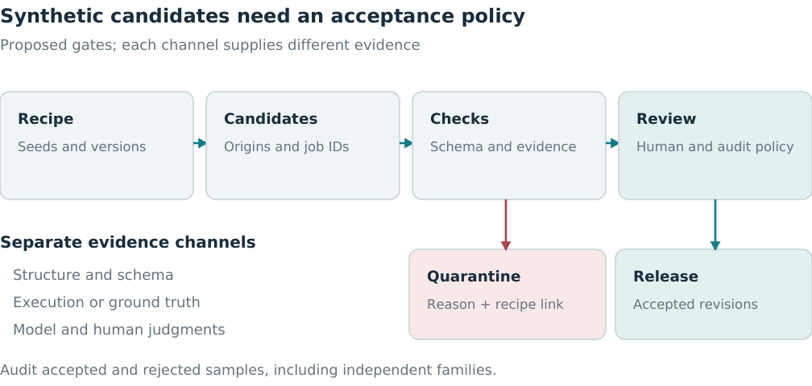

## A bounded synthetic production experiment

Write a concrete hypothesis, such as whether verified multi-step tool-error cases improve recovery on unseen scenario families. Freeze the source selection, generator/template, factor plan, environment, verifier, and review policy. Run a small preview and inspect both acceptance and rejection reasons.

Compare a baseline release with a controlled addition. Report accepted independent examples, cost, review burden, coverage changes, verifier audit results, and downstream gains and regressions. If the generator mostly creates unusable candidates, improve the task specification or source rather than scale volume blindly. If a cheaper strategy produces the same useful improvement, the more elaborate pipeline has not earned its complexity.

Synthetic production is successful when it supplies reliable, useful supervision that was missing. The number of generated tokens is an operational measure, not the scientific result.


# 9 Vision capture simulation and temporal annotation

Visual datasets contain geometry as well as appearance. A label can be semantically correct and still be unusable because it refers to the wrong orientation, crop, pixel convention, frame, or object identity. Production should preserve the original image or video, the coordinate system of each annotation, and the transforms that produce the model input.

## Collect variation that could change the decision

Start from the deployment conditions: devices, distance, resolution, motion, illumination, background, occlusion, object state, and the prevalence of empty or confusing scenes. Collect independent physical objects and sessions where the generalization claim requires them. Hundreds of adjacent frames may improve temporal coverage without supplying hundreds of independent scenes.

A capture protocol should identify which properties are deliberately varied and which remain fixed. For an object classifier, changing backgrounds can test whether the model relies on the object. For a geometry model, varied viewpoint and partial visibility matter. For a defect detector, pristine examples alone cannot establish the boundary between normal variation and the defect of interest.

Preserve negatives with a precise meaning. An empty detection scene is a reviewed statement that no target object is present under the guide, not an unlabeled image. A background class in classification is a defined category, not a universal container for every unknown object. Ignore regions, unknown classes, and occluded parts need their own semantics.

## Choose annotation units before choosing drawing tools

A class label, axis-aligned box, rotated box, keypoint set, polygon, semantic mask, instance mask, and track answer different questions. A polygon around an object's extent can include occluded material; a visible-pixel mask excludes it. The guide must say which is intended.

Store object or instance identity separately from class identity. In video, also preserve track identity and rules for disappearance, re-entry, splitting, merging, and uncertain identity. Do not quietly assign a new ID every time an object is occluded if the task requires continuity.

Image transformations need label-aware transforms. Rotating or resizing the image without its mask is an obvious error; subtler errors come from interpolation, rounding, padding, and exclusive versus inclusive bounds. Masks containing discrete class IDs generally need label-preserving resampling rather than interpolation that creates new class values. A value of 255 can mean foreground in one binary format and ignore in another. The consumer contract decides.

Use tiny boundary fixtures to test conversions: a one-pixel region on the last row/column, an empty mask, a hole, a partially visible object, and a rotated image with orientation metadata. A large attractive overlay can conceal an off-by-one error. The exact corner-versus-box and binary-mask contracts of the training companion are retained in the appendix as concrete examples.

## Simulation provides known scene state

A procedural scene can expose object identity, pose, depth, camera parameters, visible masks, optical flow, and other targets that would be expensive to annotate manually. The renderer knows the scene state; that makes some labels exact relative to the simulation. It does not make the simulated world representative of the real deployment.

Kubric joins a scene description, a physics simulator, rendering, and export. Its published pipeline supports annotations including segmentation, flow, depth, normals, trajectories, collision events, and camera parameters. This illustrates the advantage of generating inputs and targets from shared structured state rather than asking an image model to invent both independently. Asset provenance, renderer versions, and simulation assumptions still matter. [R29]

An original scene recipe for a tabletop task might sample object type, pose, distractor count, camera distance, light direction, and material. Validate physical plausibility and target visibility before rendering an expensive high-resolution frame. Save the sampled factors and realized measurements, such as visible area or actual occlusion fraction. A requested occlusion level is not a measured one.

Separate errors in the renderer, simulator, asset metadata, and target extraction. Transparent or reflective objects can make visible boundaries ambiguous. Motion blur complicates the definition of a per-pixel target. Collision meshes may differ from rendered geometry. A perfect mask of an unrealistic scene can teach the wrong deployment behavior.

## Domain randomization is a transfer hypothesis

Domain randomization varies nuisance factors so that a learner cannot rely on one synthetic appearance. Tobin and colleagues randomized textures, objects, camera properties, and lighting in a simulated localization task and demonstrated transfer in their real-world setup. This is evidence that photorealism is not always necessary for useful transfer, not proof that arbitrary randomization covers every real environment. [R30]

Choose ranges from observed deployment conditions and plausible uncertainty. Broad randomization can improve robustness, but physically impossible combinations waste capacity or teach artifacts. Too little variation encourages shortcuts. If a factor changes the target rather than merely its appearance, update the target accordingly.

Evaluate on real held-out captures that were not used to tune the recipe. Compare real-only, synthetic-only, and mixed training where the budget permits, and include an equal-compute or equal-example baseline. A synthetic validation set generated by the same renderer mostly measures consistency with that renderer. Inspect which real slices benefit and which regress.

Simulation assets also carry rights and coverage limitations. A diverse texture library does not guarantee diverse object shapes or behaviors. Changing random seeds without changing the underlying asset set may add appearance variety while preserving a narrow shape distribution.

## Model assisted masks need temporal quality checks

Interactive segmentation can reduce drawing effort: propose a mask, correct it, propagate it, and inspect failures. Record the model, prompt/clicks, human corrections, and accepted revision. Review missed objects and disputed boundaries rather than only whether the suggested region looks plausible.

Video propagation introduces drift, identity swaps, lost objects, and failures at occlusion or re-entry. Sample both routine frames and event boundaries, and inspect the complete trajectory at a speed that reveals temporal discontinuities. A high mask overlap on selected frames can coexist with incorrect identity association.

The HOTA metric formalizes the need to account for detection, association, and localization rather than only per-frame detection. Its decomposition provides a useful debugging vocabulary even when a project uses a different task-specific metric. A tracker can find the right boxes while attaching them to the wrong object histories. [R31]

A video review guide should define interpolation and propagation policies, annotation frame rate, how unreviewed frames are marked, and whether a model-filled interval counts as accepted supervision. Use actual media timestamps where frame timing is irregular. Split at the independent recording/session or object level required by the claim, not by random neighboring frames.

## Captions for image generation

For image-generation training, keep image, caption or conditioning, rights, quality checks, and transform history. Store the original caption and recaptioned revisions. An accurate simple caption can be more useful than a richly detailed false one. Ground nouns, counts, colors, composition, text, and style claims in the actual image.

DALL-E 3 research is evidence that descriptive generated captions can improve prompt following under its studied setup. It does not establish a universal preference for longer captions or publish the full image corpus. A production team should compare caption policies using a fixed evaluation rather than adopt verbosity as a quality metric. [R32]

A generation prompt is a request, not a verified description of the result. Keep original prompts, image-conditioned caption revisions, and accepted captions separate. Check nouns, counts, relationships, visible text, and style claims against the image after every crop or transform. A crop can remove the object that justified the caption. Compare caption policies through held-out prompt following and image quality, not caption length alone.

For a captioning audit, stratify by caption origin and difficult visual attributes. Let the reviewer mark supported, wrong, omitted, and unverifiable spans. Retain a simple accurate caption when the alternative adds unsupported detail. If the intended task needs only a class token or a short subject description, do not force a long scene narrative merely because another training recipe used one.

# 10 Audio segmentation alignment and diversity

Audio has at least three identities: the original recording, the selected time interval, and the canonical waveform emitted for training. Transcripts and speaker labels attach to specific intervals. Changing a boundary can change the correct target even if the filename remains the same.

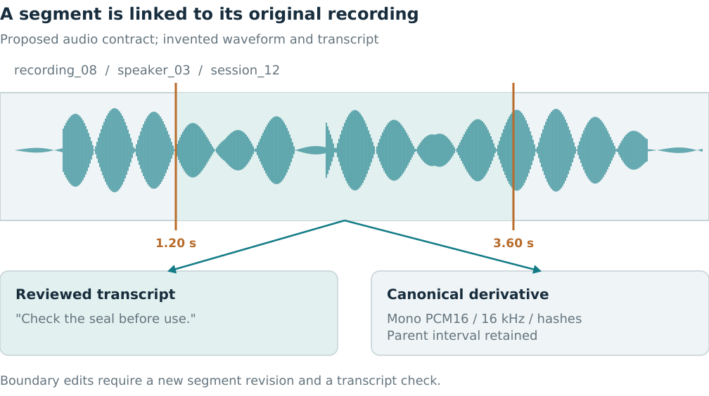

## Distinguish the stages

Voice activity detection estimates where speech occurs. Diarization estimates who speaks when, usually as anonymous speaker clusters. ASR proposes words. Forced alignment places supplied words or phonemes in time. Source separation estimates component signals. These stages can assist each other, but none proves the others correct.

The pyannote.audio 2.1 paper describes local speaker segmentation, speaker embeddings, and global clustering. It explicitly notes that local speaker indices are not automatically consistent across windows. This is a useful warning for dataset production: a local cluster label is not a verified person identity, and merging segments requires evidence and review appropriate to the task. [R33]

WhisperX combines VAD-based cut/merge, batched transcription, and phoneme alignment. Its paper states that alignment models must suit the language and that a translated transcript lacks the direct phonetic correspondence needed for this alignment method. This separates three useful outputs: a transcript, its timing, and a translation. They should not be stored as interchangeable labels. [R34]


## Segment with the target in mind

Keep original start/end times and the exact transformation to exported samples. Check boundary rounding, channel selection, resampling, silence trimming, and duration. A transcript copied from an entire recording is not valid for every segment cut from it.

Avoid cutting words or discarding a quiet speaker through an aggressive VAD threshold. A low-energy segment may be valid whispered speech, while a loud segment may be music or clipping. Automatic quality scores should be calibrated against the intended corpus, including languages, accents, channel conditions, and speaking styles that matter.

Listen after conversion, not only before it. A file can satisfy the required WAV header while containing clipped, misordered, empty, or otherwise incorrect audio. Retain source and canonical hashes and rate/channel metadata. Normalization can be useful for one task but destroy amplitude information needed by another, so make it a recipe decision rather than a silent import default.

## Decide what the transcript represents

A verbatim transcript may preserve disfluencies, repetitions, and partial words. A normalized transcript may standardize numbers, punctuation, casing, and hesitations. Both can be legitimate targets, but mixing conventions without a rule creates avoidable disagreement.

Word error rate is (substitutions + deletions + insertions) divided by the number of reference words. It can exceed 100 percent when insertions are numerous. Character error rate uses characters instead. Both depend on tokenization and normalization. Report those choices, and examine names, numbers, technical terms, and other consequential units separately when aggregate error obscures them.

Timing quality is another axis. A transcript can be textually correct but shifted by several seconds; a forced aligner can assign plausible timestamps to wrong text. Review suspicious boundaries, competing hypotheses, and no-speech segments. Hallucinated text over silence is a distinct failure mode, not merely an ordinary substitution.

For diarization, record whether overlap is allowed, how unknown speakers are represented, and whether speaker count is supplied or inferred. Evaluate missed speech, false speech, and speaker confusion under a declared scoring convention. A good transcript with wrong speaker attribution can still be unusable for a dialogue task.

## Diversity and split design need more than speaker count

Speaker diversity, session diversity, linguistic diversity, and content diversity are different. Ten people reading the same ten sentences can support some speaker comparisons while providing narrow lexical coverage. One person recorded on many devices cannot establish unseen-speaker performance.

Choose the claim and design collection accordingly. If both unseen speakers and unseen scripts are required, a corpus in which every speaker reads every script can create a large connected family under both constraints. The solution may be a different collection design, not a cleverer random split. Do not mark every shared word or language as a protected group; protect relationships that would invalidate the stated claim.

Use consented, relevant metadata for coverage analysis rather than inferring sensitive identities from voices. Preserve permission for the actual use. Recognition training, redistribution, external transcription, and cloning an identifiable voice are different scopes. A public audio URL or a clean recording is not itself proof of all those permissions.

## Recognition and generation need distinct release gates

For recognition, the target is usually text or structured linguistic information conditioned on audio. For speech generation, audio is an output conditioned on text, speaker/style information, or other controls. For sound generation, the conditioning may be a class or caption rather than a transcript.

Speech-generation review should include content fidelity, pronunciation, artifacts, speaker consistency where authorized, prosody, and naturalness. Listening preferences and automatic acoustic metrics measure different properties. A high predicted quality score cannot establish that the intended words were spoken or that a voice use is permitted.

Retain the model-specific representation as a derivative: waveform, spectrogram, codec tokens, or other features. Pin preprocessing and verify that it matches the consumer. The tiny class-conditioned waveform example in the training companion is intentionally narrow and should not be presented as a universal speech-generation contract.

## Read the applicable subset terms

Emilia-Pipe is a useful methods reference for source separation, VAD, diarization, ASR, and quality assessment. Its repository acknowledges issues including overlap and hallucinated transcripts. Its dataset card is also a warning about licensing shortcuts: a CC-BY-4.0 header coexists with terms distinguishing noncommercial Emilia from CC-BY Emilia-YODAS. Read the applicable terms and subset, not only a badge. [R35] [R36]

# 11 Text retrieval preferences and tool environments

Text records can look valid while carrying the wrong supervision. The same string can be context in one objective, a target in another, and an evaluation-only reference in a third. Keep source evidence, canonical roles, target semantics, and rendered model input separate.

## Documents conversations and preferences are different units

Continued pretraining consumes document text under a next-token objective. Instruction tuning consumes a context and desired response, often with only selected assistant tokens receiving loss. Retrieval training consumes relevance relationships. Preference training consumes comparative judgments under shared context. Typed decisions consume state, candidate options, and a target choice or distribution.

A document extraction pipeline should retain page/section anchors and ordered structure, including tables or code where relevant. Inspect OCR and cleanup on representative layouts. A classifier that prefers textbook-like prose may be appropriate for one pretraining objective and erase the informal language needed for another.

For style examples, separate facts from presentation. A teacher can rewrite a response fluently while changing a commitment or number. Review both factual preservation and style, and vary topic independently from voice. For preferences, preserve ties, both-bad, uncertainty, rubric, and candidate provenance before mapping to a binary chosen/rejected export.

For typed decisions, stable candidate IDs matter more than display order. Preserve constraints and evidence, distinguish infeasible options from less-preferred feasible ones, and define abstention where the application permits it. A calibrated probability is a prediction under a population and protocol; it is not permission to execute the chosen action. The Jev/Kev/CLM/Laya studies and original option-pointer exercise remain distinct in the companion appendix.

## Retrieval supervision and negative mining

A retrieval example links a query to one or more relevant passages in a specific corpus snapshot. Keep relevance separate from similarity. A high-scoring neighbor can be a hard negative, a duplicate of the positive, another valid answer, or an ambiguous partial answer. Unjudged is not synonymous with irrelevant.

A sound process registers a rights-cleared corpus, generates or collects queries from held-in material, verifies positive evidence spans, retrieves candidate negatives, removes related positive families, and has a qualified reviewer or validated scorer judge the remaining candidates. Preserve multiple positives and uncertainty. Record the miner and scorer versions, ranks, scores, and query-generation conditions.

Qwen3 Embedding describes synthetic weak supervision followed by labeled data and filtered synthetic pairs. Its query-generation dimensions include role, type, length, difficulty, and language. NVIDIA's public embedding recipe explicitly addresses false negatives and uses margin filtering, but its numeric thresholds are recipe-specific. Neither is a reason to label all nearest neighbors negative. [R37] [R38]

## Preference judgments and pair construction

Preserve the shared context, all candidates, display order, judge identity/version, criteria, decision, confidence when meaningful, and rationale or evidence. Allow ties, both-bad, and uncertain. Only a later pair-construction policy maps eligible judgments to chosen/rejected records for a particular trainer.

Blind and randomize A/B display when possible. Keep factual correctness separate from style and brevity. A shorter answer is not automatically better, and a rejected response is not a classification negative. Hard comparisons should include plausible alternatives; artificially broken responses can make preference learning look easy without teaching useful distinctions.

Argilla's curated UltraFeedback documentation describes cases where numeric scores contradicted strongly negative critiques. This is a concrete warning to audit judge output parsing and pair ordering, not merely trust that a model returned valid JSON. Check duplicate candidates, inverted ordering, rubric contradictions, and accidental prompt differences. [R39]

## Tool trajectories require an environment contract

A tool trace should include the tool schema/version, initial state or a reference to it, user request, assistant actions, observations, final response, and outcome evidence. Mark which observations were executed, simulated, or authored. Model targets should not teach the assistant to invent tool results.

Define what the environment guarantees. Are operations deterministic? Can calls be retried safely? Is time frozen? Are random seeds recorded? Can state be reset? Which policies are enforced by the API and which must be followed by the agent? A valid function signature does not answer these questions.

The tau-bench design combines domain databases and APIs, policy documents, simulated users, and goal-state annotations. Its construction includes manual schema/API work, model-assisted data entries, and manually designed/verified scenarios. Final database-state comparison permits different conversational paths to the same goal, while repeated trials measure reliability. This is a stronger interaction test than matching one expected call string, but it remains a benchmark environment with its own simulator and policy assumptions. [R40]

For production, include missing information, clarification, no-tool-needed cases, empty results, pagination, partial completion, denied actions, transient errors, stale state, and duplicate requests. The target should reflect what was known at the time of the action. Do not leak the hidden goal state or future observation into the model's input.

## Preserve failures that teach the right lesson

An executed rollout can fail because of the agent, the scenario, or the infrastructure. Record these separately. A timeout is not automatically a wrong action; a passing final-state check may miss an unnecessary or disallowed intermediate step. Review both outcome and process where the application requires them.

SWE-Gym packages real repository tasks with executable environments and tests so agent trajectories can be collected and checked. Its distinction between a solution patch and the interaction sequence that produced it is central: the final artifact alone does not contain the observations, failed attempts, or tool decisions needed for trajectory supervision. A passing test suite still provides bounded evidence about that environment and those tests. [R41]

Use isolated, resettable environments for dataset production rather than real customer accounts or consequential live operations. Keep secrets and unnecessary personal data out of traces. Test fixtures should model permission and policy failures without requiring actual unauthorized actions.

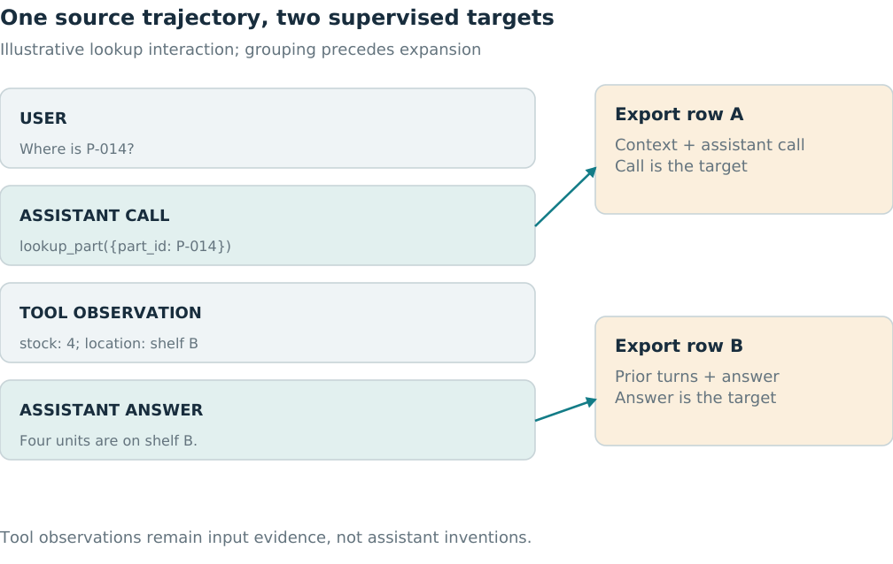

When expanding one trajectory into multiple assistant-target examples, assign its family first and preserve ordering. Evaluate closed-loop behavior separately from teacher-forced accuracy on gold prefixes. A model that predicts the next recorded call well may still fail after its own earlier mistake changes the state.

The general rule across modalities is consistent: preserve the unit, the evidence, the transformation, and the exact consumer meaning. Shared storage and review workflows are useful; one undifferentiated label field is not.

# 12 Debug data and test causal explanations

A failed prediction is a symptom. It can be caused by a bad label, a missing training condition, a representation bug, a misleading evaluation target, an unsuitable objective, insufficient model capacity, optimization, or deployment shift. The same symptom can have several contributing causes. Dataset debugging should narrow these possibilities before changing thousands of records.

The first question is whether the model saw what the author believes it saw. Decode the exported image with its exported geometry. Replay the canonical audio segment beside its transcript. Inspect rendered conversation tokens and the supervised loss mask. Verify option IDs after shuffling and retrieval positives after document preprocessing. Many apparently sophisticated model failures originate in a mundane adapter or normalization error.

## Build a failure record that supports comparison

Save the model and inference recipe, release ID, canonical example/revision, emitted input, expected target, actual output, metric result, and relevant environment state. Link the raw source and any review history. A screenshot of a bad answer alone is often insufficient to reproduce the problem.

Classify the symptom provisionally rather than force a cause immediately. Useful categories include wrong or incomplete target, missing evidence, source/transform defect, unsupported task case, uncovered slice, shortcut suspicion, tool/environment mismatch, and evaluation problem. Allow several hypotheses and unresolved status.

Inspect a mixture of conspicuous failures and randomly selected successes. A model can produce a correct answer for the wrong reason, and its most confident errors may never enter an uncertainty queue. Success inspection is particularly useful for finding leaked answer fields, duplicate test material, and spurious source markers.

## Slices turn averages into questions

A slice is a subset defined by a meaningful condition: small objects, unfamiliar devices, long tool traces, overlapping speakers, rare terminology, or a particular source family. Begin with slices suggested by the intended use and production process, then add hypotheses from errors.

Report the number of independent examples, the metric, a suitable uncertainty estimate, and the comparison being made. A slice with three failures out of four examples is concerning, but it does not estimate its long-run error rate precisely. A slice can also be difficult because its labels are less reliable; review the evaluation targets before concluding that more training material is the answer.

Intersecting factors matter. A camera-specific failure may actually be a class imbalance or a lighting difference correlated with that camera. A language-specific failure may reflect transcript normalization or domain vocabulary. Observing the association identifies a useful investigation, not a causal explanation.

An intentionally constructed challenge set can isolate a hypothesized mechanism, such as changing only the order of decision options or replacing an irrelevant background. It measures behavior under those transformations. It does not estimate how frequently the condition occurs in deployment. Report challenge results separately from representative evaluation.

## Automated slice discovery is a hypothesis generator

Domino combines cross-modal embeddings with an error-aware mixture model using embeddings, labels, and predictions, then proposes language descriptions. The paper evaluates 1,235 slice-discovery settings and separately tests representation and slicing choices. Its appendix reports lower discovery performance on rare slices and notes differences between synthetic and trained-model settings. Those details matter: a coherent-looking cluster and an attractive description do not prove that all relevant failure groups have been found. [R42]

Use embedding clusters to organize inspection. Review representative members, boundary members, and nonmembers. Ask whether the description actually distinguishes the cluster, whether it is an artifact of the embedding model, and whether the error remains on a fresh sample with that condition. Retain manually defined slices for factors the embedding might ignore.

Searching many slices until one looks bad creates a selection effect. Use a development set for discovery, freeze the proposed slice definition, and confirm the result on independent material where possible. Multiple-testing corrections, minimum support, and effect-size thresholds can help, but they do not fix a semantically invalid slice definition or leaked evaluation.

## Training dynamics reveal different kinds of difficulty

Dataset Cartography records the probability assigned to the provided target across training checkpoints and summarizes its average and variability. In its WinoGrande experiment, selecting the most variable third achieved 87.6 percent on the OOD WSC evaluation versus 86.0 percent for all training data, while ID accuracy decreased from 79.7 to 78.7; both were means over three seeds. Yet very small variable-only subsets failed to optimize, and adding easier examples helped. Building the map itself required a full training run. This is a conditional tradeoff, not a rule to discard easy data. [R43]

An original four-checkpoint illustration helps interpret the measurements. Example A receives target probabilities 0.1, 0.2, 0.8, 0.9; its mean is 0.5 and it varies substantially. Example B receives 0.5 at every checkpoint; it has the same mean and zero variability. A is unstable over training, whereas B is persistently uncertain. Calling every uncertain example “ambiguous” would erase this distinction.

A consistently low target probability can indicate a wrong target, a rare valid example, a task the model cannot learn, or a preprocessing defect. Consistently high probability can indicate a useful easy example or an exploitable shortcut. The map summarizes a relationship among this model, this training recipe, and these labels. It is not a model-independent truth map of the dataset.

Use dynamics to nominate examples for investigation and selection experiments. Preserve the checkpoint schedule and scoring definition, because changing them changes the map. Do not evaluate a selection policy only on the same outcomes used to choose it.

## Influence asks which training changes might matter

Similarity search retrieves related examples. Influence methods ask a more specific question about the training procedure. That distinction is useful: a visually similar training image may not have had the strongest effect on a particular prediction, and an influential example may reveal a shortcut that is not semantically similar to the query.

Koh and Liang's influence-function approach approximates the effect of infinitesimally upweighting a training example at a fitted optimum. The test-loss derivative combines the test gradient, inverse training-loss Hessian, and training-example gradient with a negative sign. Approximating removal uses a negative weight change, so sign conventions must be checked. The formal derivation assumes smoothness and strict convexity; the paper also explores approximations outside those assumptions. [R44]

This explains both the attraction and the limit. One can nominate training records for a particular failure without retraining from scratch for every candidate. But an infinitesimal local perturbation is not the same intervention as deleting a large cluster, changing an ontology, or retraining a nonconvex model with a different optimization path.

Basu and colleagues found strong sensitivity of influence estimates to architecture, regularization, and test-point choice in their studied networks. Their reference influence itself used limited retraining from fitted parameters. A later reanalysis by Epifano and colleagues questioned how validation procedures and rank-correlation summaries contribute to apparent fragility. The responsible reading is that influence accuracy must be tested against a clearly defined intervention in the intended setup, not that one paper proves the method universally works or universally fails. [R45] [R46]

TracIn targets a different quantity: how training examples contribute to loss change along an optimization path. Its practical checkpoint form uses learning-rate-weighted gradient dot products. The paper explicitly distinguishes this from leave-one-out retraining, and its mislabeled-example experiment injects known label changes rather than measuring every naturally occurring error type. Checkpoint and layer selection make the computation practical but introduce approximations. [R47]

A production workflow can use any of these scores to choose a small review or retraining experiment. Record the method, checkpoint, loss, layer choice, and target evaluation examples. Compare with inexpensive baselines such as loss, model-label disagreement, and nearest neighbors. If an expensive attribution method finds no more actionable errors per unit cost, it may not be the right tool for that project.

An influential example is not automatically a bad example. It may teach an essential rare skill. A negative influence score is meaningful only relative to the target and sign convention; an evaluation label can itself be wrong. Influence does not establish ownership, consent, or that a model memorized a particular source. Those require different evidence.

## Test a proposed repair with an explicit intervention

Suppose inspection nominates 200 suspect records in a 10,000-example classification set. An original experiment could compare four conditions:

1. Baseline: retain the original release
2. Random removal: remove 200 records under a matched sampling policy
3. Targeted removal: remove the 200 nominated records
4. Targeted correction: retain the same inputs but replace only confirmed incorrect targets

Keep a frozen, independently reviewed evaluation set and predeclare the important slices. Record whether training is equalized by examples, steps, tokens, or compute. Reweighting, duplication, and removal change effective exposure, so even a one-line dataset edit can have several effects.

If targeted removal beats the baseline but not matched random removal, the result does not show that the nomination method identified uniquely harmful data. If correction beats both removal conditions, preserving useful inputs with better targets may be the better policy. If the average improves while a rare slice worsens, the decision is a tradeoff rather than an unconditional success.

Use repeated training seeds where feasible and report individual runs, not only the best seed. Evaluation sampling uncertainty and training-run variability are different quantities. A family-level bootstrap over predictions estimates one component; repeated training runs estimate another. Very small differences may remain inconclusive under the available budget.

For source mixtures, a factorial or staged ablation can reveal interactions: adding source A may help only when source B is retained. The sum of individual gains need not equal the joint gain. An apparently redundant example can become useful after another subset is removed. This is one reason a permanent row-level value is an incomplete model of data utility.

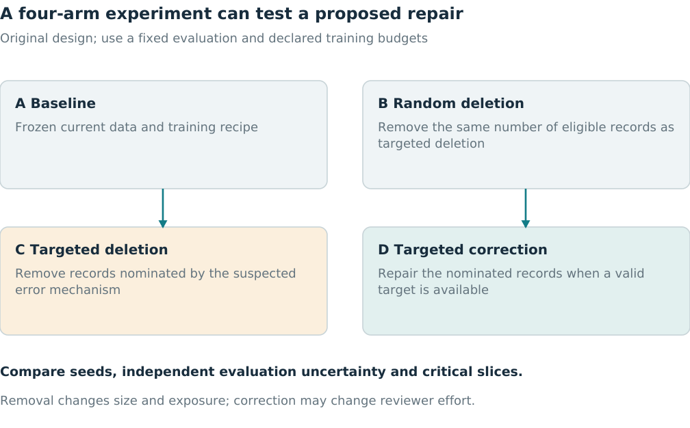

## Distribution shift changes what an evaluation means

WILDS provides naturally occurring shifts across domains such as camera traps, hospitals, time, and locations, with dataset-specific evaluation protocols. Its design distinguishes domain-generalization settings from subpopulation shifts rather than treating every random holdout as evidence of robustness. The benchmark is a collection of concrete shifts, not a complete representation of all future deployments. [R48]

For a local project, imitate the logic rather than the exact benchmark. If deployment will face new sessions, devices, source organizations, or future time periods, create a corresponding holdout when data permit. If the use is a known corpus with new queries, say so; do not relabel that result as unseen-corpus generalization.

A transformed test set can probe a mechanism, but the transformation must preserve or deliberately change the label under the task definition. Rotating an image may preserve object identity while invalidating a text-reading target. Removing a tool observation may turn an answerable question into one that requires clarification. A failed invariance test is meaningful only after the intended invariance has been justified.

## Some failures are underdetermined by the training objective

The underspecification study shows how predictors with similar ordinary held-out performance can differ in behavior under stress tests and contrasts. Its evaluation framework includes shifted distributions and matched transformations, which ask different questions from average in-distribution performance. This means dataset cleanup alone cannot guarantee a specific deployment behavior; the training and validation procedure may leave that behavior unconstrained. [R49]

Respond by adding a justified specification and test, not by assuming every seed difference is a bad row. Depending on the mechanism, the repair may involve new evidence, a different objective, model constraints, an inference policy, or a more appropriate evaluation. Dataset production is central to the system, but it is not a substitute for system-level diagnosis.

## Close the loop without contaminating the final test

When a diagnosis changes training data, record the release difference and the hypothesis it tests. Keep a compact experiment log: intervention, rationale, budget, seeds, selection metric, results by slice, uncertainty, regressions, and unresolved alternative explanations.

Development examples can legitimately become training examples when their role changes explicitly. A final-test family should not quietly feed targeted generation or source selection while remaining labeled untouched. Once a benchmark is used repeatedly to choose repairs, its role has changed. Establish fresh independent evaluation when making a new generalization claim.

A useful debugging result can be negative: the suspected source was not the cause, the improvement did not reproduce, or the current budget cannot distinguish the alternatives. Recording that result prevents the next production cycle from repeating an attractive but unsupported story.

# 13 Reconstruct published production systems

A public pipeline is evidence about a particular system at a particular time. It is rarely a complete operational manual. This chapter reads five cases as experiments: what went in, which decision changed, what was measured, and which costs or failure modes remain invisible. The reconstruction questions are original analytical tools; the compact evidence capsules describe published results. Historical model names identify those experiments, not a claim that these are the newest models available.

## Case 1 DCLM makes data selection the experimental variable

**Published evidence.** DataComp-LM standardizes candidate data, training, and evaluation so curation methods can be compared. Its construction experiments cover extraction, deduplication, learned filtering, and source mixtures. With downstream performance similar between two stronger HTML extractors, the authors selected the faster one. A fastText quality filter trained on positive reference documents and random web negatives performed strongly. At its reported setup, stricter selection helped, but an appendix feature ablation improved Core/MMLU while slightly reducing Extended performance. The filter therefore did not optimize every evaluation equally. These are controlled comparisons at specified scales; the 240-trillion-token candidate pool is not the number of tokens consumed by every training run. [R50]

**The decision structure.** A filter is a classifier of resemblance to its reference examples. Calling its output “quality” does not turn it into an intrinsic property. Before copying such a pipeline, ask what the positive set teaches the filter to favor: explanatory writing, topic, format, vocabulary, or an accidental source signature. Hold the candidate pool, token budget, training recipe, and evaluation fixed while changing the reference set. Otherwise a better score may come from a different corpus or more compute.

**A small-team reconstruction.** Start with one legally usable corpus and three filter arms: transparent rules, a reference-trained classifier, and a random sample. Use the same tokenizer and consumed-token budget. Inspect accepted and rejected samples by source and language. Then compare a downstream score and a coverage measure. If the classifier wins on general QA but removes nearly all terse logs, decide whether logs are irrelevant or an essential deployment slice. That decision cannot be delegated to the benchmark average.

**Unknowns and cost boundary.** Published curation experiments do not reveal every expense of producing a maintained, rights-reviewed corpus. Reproducing a downstream result also requires the released training recipe and source availability, not only copying the filter threshold. The transferable lesson is the experiment design: compare data interventions under a known consumer. It is not “keep ten percent of any corpus.”

## Case 2 FineWeb Edu distills an expensive judgment into a cheap filter

**Published evidence.** The FineWeb-Edu classifier card describes a frozen embedding encoder with a trained regression head, learned from 450,000 Llama-3-70B-Instruct annotations. A threshold of three yields a reported binary F1 of 82% against teacher-labeled validation examples. Its rubric emphasizes school-level educational content and can underrepresent specialized or higher-level material. That F1 measures reproduction of the teacher rubric, not human-certified educational value. [R51]

The authors' technical report evaluates the filtered corpus through language-model training. Applying the classifier to the original 15-trillion-token FineWeb corpus reportedly required 6,000 H100 GPU-hours. Raising the threshold beyond three improved some knowledge/reasoning evaluations while harming HellaSwag and PIQA. The initial threshold experiment used a 1.82B model and eight billion tokens from one crawl; a longer 350-billion-token study broadly supported threshold three, with a slight HellaSwag degradation. This is a concrete quality-coverage tradeoff, not a universally increasing quality scale. [R52]

**What the two-stage architecture buys.** A costly teacher can annotate a small sample, and a smaller model can screen the full pool. This separates annotation cost from corpus size. It also inserts a second error channel: teacher misjudgment and student approximation. A production audit should therefore inspect four groups: teacher/student agreement on acceptance, agreement on rejection, teacher-only acceptance, and student-only acceptance. Sampling only disagreements misses shared blind spots.

**An original counterexample.** Imagine a documentation assistant whose important inputs are short API signatures, terse compiler errors, and expert migration notes. A school-level explanation rubric may rank these low even when they are exactly what the assistant needs. The response should be a task-specific slice and reference-rubric experiment, not an attempt to make the student imitate the original teacher even more accurately.

**Maintenance evidence.** The dataset card records additional crawls and a later processing fix that added previously missed documents. A dataset name consequently identifies a family of releases, not an immutable training population. Pin the revision, crawl set, and selection threshold. [R53] This case also shows why “reproduce the classifier” and “reproduce the dataset” are different commitments.

## Case 3 Tülu 3 builds supervision for successive training stages

**Published evidence.** Tülu 3's public recipe proceeds through supervised fine-tuning, preference optimization, and reinforcement learning with verifiable rewards. These stages use different signals rather than one universal conversation table. Its public release includes data and training components, enabling inspection beyond a model card. [R54]

The paper's preference pipeline samples responses from multiple models, scores them with a judge on several criteria, and constructs chosen/rejected pairs. Its ablations compare prompt reuse, on-policy versus off-policy responses, and mixtures. More duplicated prompts did not reliably improve results; on-policy responses helped aggregate DPO performance, and the selected mixture combined sources. The authors also describe n-gram decontamination and report that semantic similarity could confuse related subject matter with true contamination. These are choices within a particular post-training stack, not a guarantee that its judge or mixture transfers unchanged. [R07]

**Why model provenance belongs in the row.** A rejected answer must be plausible for the model being improved if the goal is to distinguish its actual alternatives. Extremely weak rejections may teach an easy distinction the student already knows. Conversely, restricting everything to the current student can miss useful behaviors it rarely generates. This motivates an experiment with two axes: prompt distribution and response-generator distribution. Keep the preference rubric fixed initially so their effects can be interpreted.

**A reproducible miniature.** Use 300 development prompts divided into ordinary, boundary, and difficult tasks. Generate two current-student responses and two reference-model responses per prompt. Judge blinded, preserve ties, and inspect a stratified human sample. Construct a student-only preference set and a mixed-generator set with the same number of non-tied pairs. Train with the same budget; evaluate on held-out prompt families using both task success and style criteria. These counts are an illustrative experiment, not the Tülu recipe.

**What remains unknown.** Public experiments can compare recipes while leaving total staffing, failed exploratory runs, and ongoing data maintenance costs unreported. A final model gain also bundles interactions among stages. To attribute benefit to a new preference corpus, compare it against the same starting checkpoint, objective, token exposure, and evaluator. Do not infer that a DPO-ready dataset can be consumed by an unrelated SFT-only trainer.

## Case 4 SAM 2 improves both annotations and the annotation process

**Published evidence.** SAM 2's data engine progresses from per-frame assisted masks to mask propagation and then interactive temporal correction. In a controlled annotation comparison, reported time falls from 37.8 to 7.4 to 4.5 seconds per frame. A separate verifier returns unsatisfactory masklets for correction and rejects ill-defined targets; automatically proposed masklets also pass verification. Phase-three alignment to the phase-one reference exceeds IoU 0.75 for 89.1% of all masks, but only 72.8% of small-object masks. The speed result does not imply uniform quality. Adding successive data stages improves the reported fixed-iteration segmentation experiment. Evaluation annotations use the earlier per-frame method to reduce bias from the model under evaluation. The released SA-V corpus is not the entirety of SAM 2's training data. [R55]

**Why this is a data engine.** The annotation model changes the cost of collecting examples, while corrected examples improve that model. This feedback is productive but can narrow what humans see. If model proposals determine which objects enter the dataset, unnoticed objects can remain absent forever. An independent sampling route, occasional annotation from scratch, and size-specific audit can expose this blind spot.

**An original staffing calculation.** At the published per-frame timings, 10,000 annotation frames correspond to roughly 105, 21, or 12.5 direct annotation hours. Those are arithmetic conversions, not quotes for running the full pipeline. They exclude video acquisition, annotator preparation, verification, rework, model inference, idle time, and project management. If verification takes longer on small objects, the cheap-looking average can hide the expensive slice that determines product quality.

**How to test transfer.** Randomize your own clips between manual-first and model-assisted workflows. Balance annotator experience; compare final masks through blinded review and retain labor time by stage. Count identity switches, missed reappearance, and small-object loss as well as spatial overlap. A faster first pass is valuable only if correction and verification do not erase the saving. This is a general evaluation protocol, not a claim about the original study's unreported labor organization.

## Case 5 Granary repairs boundaries and pseudo labels together

**Published evidence.** Granary combines segmentation, language identification, retranscription, and filtering for multilingual speech. Its pipeline uses language- and corpus-specific filters, including hallucination patterns and character-rate checks. The paper reports that alternative segmentation methods did not significantly change final performance, but omits those detailed results. A punctuation/capitalization refinement falls back to the original label when text changes too much; the authors explicitly leave the quality of these refinements for further testing. In the English comparison, Granary uses 14,000 training hours versus MOSEL's 23,500. FLEURS WER without punctuation/capitalization improves from 15.77 to 13.93, while Common Voice's corresponding WER changes from 26.16 to 26.40. The pipeline therefore does not improve every reported endpoint. This comparison changes data and label processing together, not a single isolated filter. [R56]

**Why alignment is part of the label.** A transcript can be linguistically correct yet wrong for its exported segment. If the boundary cuts off a word, training teaches the model to produce text unsupported by the waveform. Conversely, repeated transcription of a badly segmented clip can preserve the same error. Debugging must inspect the audio interval, not only edit the text column.

**Task-specific rejection.** A monolingual recognizer and a code-switching recognizer should not inherit identical language filters. A clip containing two languages may violate one release specification and be valuable evidence for the other. Record a reason code such as “outside monolingual task scope” rather than declaring the clip universally invalid. This distinction keeps rejection reversible and permits different views over the same source.

**The release boundary.** The Granary card warns that the repository provides manifests; original audio must be acquired and arranged separately. It distinguishes task hours for ASR and translation and identifies constituent license obligations. [R57] An apparent million hours of tasks should not automatically be counted as a million independent hours of unique audio. A training export must resolve source IDs to real files, validate duration and offsets, and freeze exactly which task view was used.

## A comparison framework worth keeping

These cases intervene at different points. DCLM compares selection policies. FineWeb-Edu scales a rubric through distillation. Tülu 3 changes supervision between optimization stages. SAM 2 changes the human-machine annotation loop. Granary repairs the segmentation/transcription/filtering chain. None reduces to “generate more synthetic data.”

For any new lab report, fill in this compact evidence record before copying its headline:

- **What was changed?** One stage, a whole pipeline, or both data and training recipe
- **What stayed fixed?** Candidate pool, tokens, optimizer, model, compute, evaluator
- **What is the denominator?** Raw candidates, accepted examples, unique families, tokens, hours, frames
- **What improved or worsened?** Aggregate and relevant slices, not only the selected headline
- **What is measured directly?** Human review, model proxy, executable check, or downstream outcome
- **Which costs are counted?** Generation, filtering, annotation, audit, training, maintenance
- **What is unpublished?** Failed trials, private sources, staff time, evaluator construction
- **What transfers?** A testable local hypothesis rather than a copied threshold

# 14 Economics scale and maintenance

The meaningful economic unit is rarely a raw row. It may be a reviewed independent example, an hour of aligned speech, a verified successful trajectory, or an improvement in a critical evaluation slice. A cheap generator can create an expensive dataset if most candidates are unusable or if review and maintenance dominate the budget.

## Count the whole pipeline

Track source acquisition, permission review, extraction, preprocessing, generation, automatic validation, expert review, adjudication, storage, export tests, evaluation training, and ongoing corrections. Include setup effort separately from marginal costs. Record actual rejected work and uncertain job outcomes rather than reporting only successful outputs.

An original illustrative batch makes the distinction concrete. Generate 10,000 candidates at $0.02 each. A cheap structural screen accepts 80 percent. Verify those 8,000 at $0.05 each; half pass. Review the remaining 4,000 at $0.50 each; accept 90 percent. Ignoring setup, storage, and structural-screening cost for the moment, the counted cost is $200 + $400 + $2,000 = $2,600, and 3,600 accepted examples cost about $0.72 each. The advertised generation cost of two cents is a poor description of the resulting dataset.

These are invented prices and pass rates, not vendor quotations. The probabilities are conditional on reaching each stage. Multiplying unrelated unconditional pass rates would be wrong when failure modes correlate. If many accepted outputs belong to the same few seed families, cost per independent family can be much higher still.

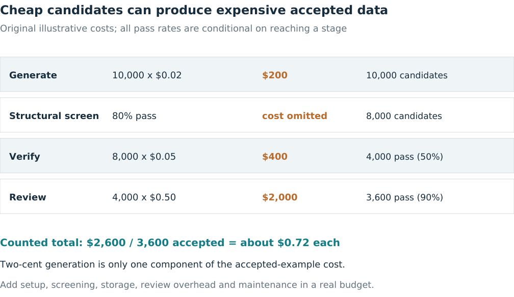

## Order checks with both cost and constraints in mind

For two order-independent filters A and B with costs c_A and c_B and pass probabilities p_A and p_B, expected cost per candidate is c_A + p_A c_B when A runs first, and c_B + p_B c_A when B runs first. Under those assumptions, compare cost per expected rejection, c/(1-p). A cheap filter that rejects many invalid candidates belongs early.

This derivation is a planning aid, not a universal scheduler. Filters can change representations, depend on earlier outputs, have correlated conditional pass rates, or alter which error is observable. Privacy and permission checks may have to precede any external call regardless of price. A low-cost filter that removes important rare cases can reduce utility even while lowering processing cost.

Log funnel counts by meaningful slice. A source with a 95 percent acceptance rate may simply contain easy, repetitive material. A 40 percent acceptance rate may be justified for a scarce but important condition. Compare cost and utility with coverage constraints, rather than optimize global acceptance alone.

## Allocate review to the question

There are at least three review budgets: learning the failure profile of a new source, repairing likely important errors, and estimating release quality. Assign them explicitly. A high-yield repair queue should not consume the entire random audit budget, and an audit designed for a global mean may need a separate minimum sample for a critical slice.

For independent stratified estimation under a fixed cost budget, a useful theoretical allocation is proportional to stratum weight times standard deviation divided by the square root of review cost. It follows by minimizing the estimated variance subject to total cost. In practice, pilot estimates are uncertain, reviewers differ, and some strata need a coverage floor. Use the formula as a starting point, then state the constraints and why allocation changed.

For repair, an approximate decision score can combine probability of error, likelihood that review can resolve it, consequence of the error, and expected cost. These quantities are estimates, not objective values. A high-confidence wrong label in a common source can be more valuable to review than a permanently ambiguous edge case. An unresolved item may need new evidence rather than five more votes.

Adaptive annotation can request a second or expert judgment when a first pass identifies a known risk, but it changes which items have repeated labels. Agreement measured only on escalated items describes those items. Keep a separately selected overlap sample if the goal is to estimate ordinary inter-annotator reliability.

## Generation scale does not remove human bottlenecks

Suppose generation takes seconds but expert review takes two minutes. Increasing generator throughput tenfold may only enlarge a waiting queue. Measure queue age, accepted-output latency, and rework, not just requests per second. Preview batches should reveal review burden before a full run creates more material than can be checked.

A good guide, a reliable local validator, or a better source may reduce costs more than a cheaper teacher. Conversely, over-engineering orchestration can consume the entire budget of a small project. Use simple resumable jobs and explicit IDs until workload measurements justify distributed systems.

The Data Cascades study interviewed 53 practitioners working in high-stakes domains and described how upstream data problems compounded through technical and organizational handoffs. Its reported prevalence belongs to that qualitative sample, not all machine-learning projects. The transferable lesson is that documentation, responsibility, incentives, and domain communication are part of production quality; adding a model does not repair a broken handoff. [R58]

## Budget for change after release

A dataset accumulates dependencies: extracted text, crops, embeddings, generated variants, annotations, exports, indexes, and model runs. Store enough lineage to invalidate affected descendants when a source, ontology, permission, or preprocessing recipe changes. Recompute only what depends on the change when that is correct, but do not reuse a cached verdict under a different task or model without checking its validity.

Hash-identical bytes can still have changed permitted use or interpretation. Conversely, changing archive timestamps need not mean the logical training records changed. Version source content, annotation semantics, selection, split maps, adapters, and evaluation separately so maintenance can identify which layer moved.

Physical storage, retained backups, review history, access controls, and withdrawal work all have continuing costs. A responsible production plan includes who can correct or remove data, how affected releases are marked, and what happens to downstream models. Deleting a source file does not prove that a trained model has forgotten it.

The long-term objective is not to eliminate every uncertain example at any price. It is to spend effort where it improves the reliability and usefulness of the training claim, while making unresolved uncertainty and use restrictions visible.

## Scale storage around the access pattern

Separate an authoritative manifest from physically convenient shards and caches. Small JSONL releases are easy to inspect. Columnar tables help scan selected fields; media archives or shards can reduce the overhead of opening many tiny files. These choices do not change which revision was accepted. Preserve a mapping from every materialized record back to its canonical ID and source.

Shard size is a throughput and recovery decision. Very small shards create scheduling and request overhead. Very large shards make a small retry or update expensive and can reduce parallelism. Measure startup time, sustained examples per second, worker imbalance, decompression cost, and wasted reads under the actual loader. Randomization only between shards can leave long runs of one source if records inside each shard are ordered by domain. The shuffle plan therefore belongs in the training recipe.

A failed distributed job should be resumable without duplicating accepted records. Use stable work IDs, explicit attempt IDs, idempotent writes where possible, and a commit step that distinguishes partial from complete outputs. If a remote generation response disappears, its outcome is unknown until reconciled. Blind retries can create duplicate outputs and repeated charges.

Caches are valid only under their dependency contract. An embedding depends on source text, tokenizer, model, pooling, and normalization. A quality score also depends on the rubric and context. Changing a rights record may require exclusion even when all bytes and cached tensors are identical. Fingerprints can help identify cached computations; they do not replace permission or adjudication records. [R59]

For incremental maintenance, first compute the affected descendants, then determine which checks must rerun. A typo fix may invalidate a text hash, tokenization, and embedding while leaving an independently measured audio duration unchanged. An ontology change can invalidate labels without changing media bytes. Measure the fraction of a release reused safely and the effort required to rebuild the rest. Fast recomputation is valuable only when the dependency graph is correct.

# 15 Freeze releases and test the emitted data

## A release is a selection of exact revisions

A working collection is mutable: filters change, annotations improve, and new candidates arrive. A release freezes selected example revisions, source and derived hashes, schema and ontology versions, source-use references, split assignments, recipe versions, mixture weights, exclusions, and quality evidence. Later corrections produce another release rather than rewriting the old identity.

An export adds the adapter version, intended reader/version, file layout, transformations, emitted hashes, and validation result. Two exports can serve different trainers from the same canonical release. A classification folder tree and an image-caption metadata tree need not become competing sources of truth.

The release card should state purpose, intended and excluded uses, source composition, counts by row and independent family, real/generated/verified proportions, collection and annotation methods, split claim, deduplication and contamination checks, rights limitations, known quality issues, and the exact validation performed. A Croissant metadata file can supplement that card when interoperable schema/provenance descriptions are useful; it is neither a quality verifier nor a storage system. [R60]

## Make every adapter declare its boundaries

A proposed adapter interface can expose validate(release), preview(release), and materialize(release, output). Its declaration names required fields, supported tasks, split names, transformations, emitted files, unsupported cases, and target reader. Validation should fail before materialization when a critical field or compatible target is absent.

The preview should show exact output records and their source IDs. For geometry, render the decoded exported annotation on the exported image. For text, show actual template and loss mask. For audio, play the canonical clip and display its sample count and transcript. A syntactically valid JSONL file can still teach the wrong thing.

Portable paths should be relative to the release root where the consumer supports them. Check path containment, missing files, hash mismatches, unsafe filenames, and relocation to a fresh directory. If a consumer deliberately uses local absolute paths, disclose that stage and test the adaptation rather than call it portable.

## Loader tests are the acceptance test

A first fixture should contain a few valid examples plus deliberately invalid cases. Run the real reader, inspect one batch, confirm target shape and type, and verify that loss supervision lands on the intended elements. Record CPU/data-contract checks separately from GPU/model-runtime tests. Reading a trainer's code does not prove an export successfully ran.

Include corruption and boundary fixtures: rotated EXIF images, one-pixel edge boxes, crossed polygons, hidden corners, empty masks, mismatched mask dimensions, 0/1 masks that violate the required 0/255 encoding, rectangular masks affected by 90-degree rotations, short/long audio, synthetic_fixture flags, stale hashes, missing or empty class folders, fewer than two classes, nonexistent option IDs, prompt-only conversations, overlength answers, and query positives that differ from the corpus text.

Split checks need transitive cases, not only identical IDs: shared sessions across books, speakers across recordings, derivatives across crops, and paraphrases across scenarios. Review tests should cover stale saves, rejected proposals, annotation history, ontology changes, and reproducible releases. Job tests should cover cancellation, restart, deleted outputs, duplicate outputs, and uncertain lost responses.

Archive byte reproducibility also needs a policy. Stable record ordering and hashes can be guaranteed while ZIP timestamps differ. State whether reproducibility means identical logical records, identical media bytes, or an identical complete archive. Do not promise one while testing another.

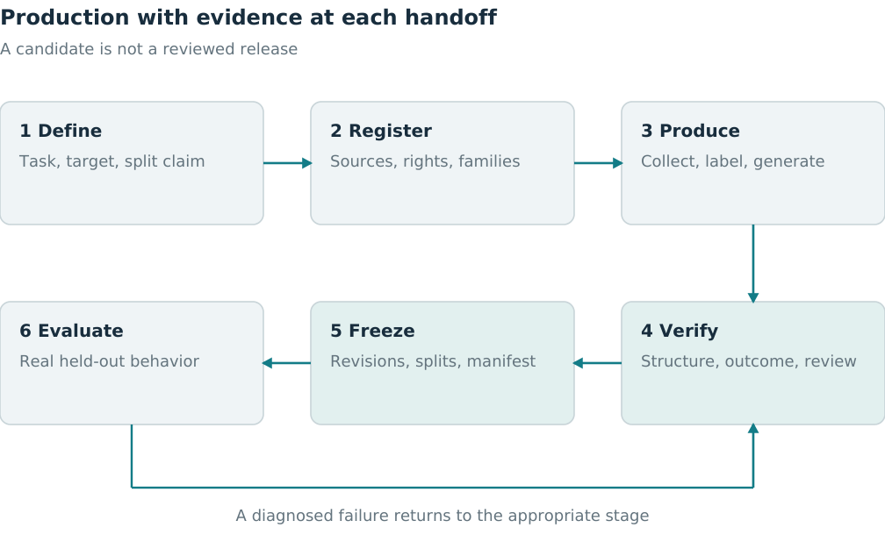

# 16 Apply the methods to Tuldok

This final application chapter assumes the general methods already established. Readers interested only in dataset science can skip it without losing the main argument. All workspaces and changes below are proposals for discussion, not an approved implementation plan.

## The audited baseline

The inspected default branch of MrScripty/Tuldok [R61] is main at commit 2fc4a46 [R62], dated 14 September 2026. It uses Python 3.10+, the standard-library ThreadingHTTPServer, SQLite in WAL mode, Pillow, and a plain HTML/JavaScript/CSS frontend with no JavaScript build step. Its default binding is 127.0.0.1:8091. These are the foundations of a local application, not an authenticated multi-user service. [T01, T02]

The current interface has a collection, a camera/image/generation workspace, and a label/settings inspector. Import, filter, previous/next, save-and-next, unsaved-change protection, zoom, keyboard adjustment, provider selection, and job stop/resume already form a useful vocabulary. A general workbench should preserve that speed. [T03, T04]

The backend stores original source bytes separately from an EXIF-oriented RGB working image and thumbnail. Source-byte SHA-256 prevents exact duplicate uploads. The annotation contract distinguishes no-book examples from hidden or off-frame corners, validates ordered geometry, and retains legacy image-relative interpretation where the newer book-relative reference is absent. Stale saves, deletes, and suggestions are guarded by revision checks. [T02, T07]

Model labeling is a proposal returned to the editor; saving remains a human step. Synthetic generation has persistent jobs and entries, interruption/cancellation/resume states, and a sequential worker that avoids repeating completed items. Generation and suggestion metadata already establish a starting point for provenance. Tests exist for dataset, provider, browser, and job behavior; they were inspected for this research, not executed. [T05-T09]

## Where the current model stops

The sample table holds one annotation JSON value. A revision counter prevents stale overwrites but does not preserve old labels. The validator, model-output schema, controls, and exporter are all specialized for book corners. There is no first-class task ontology, multi-annotation asset, independent review history, adjudication, frozen release, rights record, transcript editor, or retrieval judgment screen in the inspected baseline. [T02-T06]

The current ZIP captures labeled working images and current annotations, including unassigned split values; it excludes original source bytes. It is a training export, not a complete archive. That distinction should remain visible even after a separate archival export is designed.

Current split inheritance follows book_id when present and uses session_id for no-book examples. It does not simultaneously enforce every book and session relationship. Two different books photographed in one session can therefore fall into different splits under a book-based policy. That may fit one experiment, but it is not evidence of session-disjoint evaluation.

Source-byte hashes also do not catch identical decoded pixels stored in different encodings, neighboring frames, crops, or paraphrases. These need additional relationships and checks rather than replacing the useful raw hash. Gallery refresh and job polling retrieve broad sample information; pagination and incremental updates are sensible candidates when measurements show a bottleneck. The source alone does not establish a maximum reliable dataset size.

The README says no distribution license has yet been selected. Public visibility must not be described as an MIT or Apache license. That matters for others reusing the code and for choosing integrations; it is not an obstacle to the owner developing the project. [T01]

## The newer integration branch

A separate branch, integration/torch-image-provider-contract, was inspected at 7d7e6e6 [R63], dated 27 September 2026. Main offers Codex, OpenRouter, and llama.cpp for corner suggestions and uses Pumas for image generation. The integration branch adds Pumas labeling and VLM endpoint discovery, arbitrary generation width/height with a 1280 by 720 default, and a changed image-request lifetime policy. These are branch-specific findings, not default-branch features. [T10-T12]

The integration README says an admitted generation runs until completion, failure, or cancellation without a total/read/idle duration deadline. A lost response is therefore an uncertain outcome: the provider may have continued working. A future Retry action should retain request identity, reconcile when supported, and disclose possible duplicate work or cost. An interrupted response must not automatically be labeled a failed generation.

## An additive boundary

Keep book_corners_v2 as a supported task with its existing editor and export. Introduce a task registry around its validator and serializer, then add new inspectors one at a time. An append-only revision table can coexist with a current-label projection used by the legacy screen. The migration must preserve old coordinate semantics, source identity, and every existing workflow before it expands them.

This recommendation does not commit Tuldok to its current framework forever. It says that a framework rewrite is not a prerequisite for proving the first new dataset vertical. Measure local workload, concurrency, media size, and collaboration needs before choosing a larger architecture.

The interface concepts in this chapter preserve the familiar collection, central workspace, and inspector. They share navigation, review states, provenance, and release controls while giving each modality the controls it needs. All figures use invented small example records and are explicitly proposed interfaces.

## Dataset overview and readiness

The overview begins with the task contract and intended evaluation claim. A left collection rail filters source, modality, task, split role, review state, family, duplicate cluster, rights state, and proposal model. The center shows coverage and an example gallery. The right inspector shows release readiness and the highest-value unresolved issue.

The funnel distinguishes candidates from reviewed and released examples, and counts independent families beside rows. A click on “three cross-split families” opens the actual conflicts. A click on “caption count mismatch” opens the image and offending span. A single opaque quality score would conceal these actionable differences.

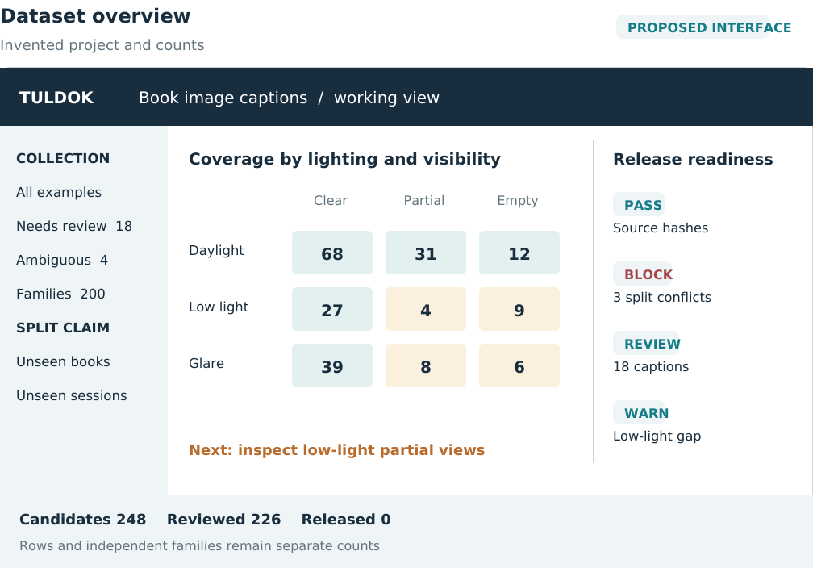

The primary action should depend on the task: inspect a gap, continue review, resolve a blocker, or compare a release. Generate remains available, but it is not the universal answer. Saved views are queries over the canonical collection, not duplicated copies of the assets.

## Task aware annotation

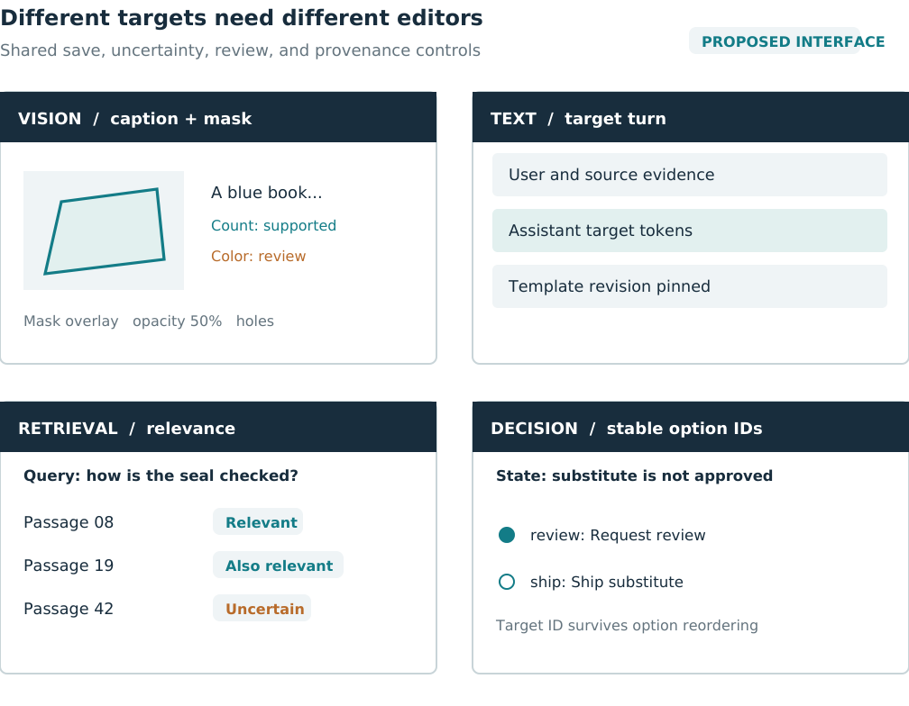

For classification, the inspector provides stable class choices, keyboard shortcuts, ambiguity, model disagreement, and a coverage slice. For corners it retains the current point workflow. For segmentation it switches to a real mask editor with brush/erase, holes, opacity, and boundary zoom. The common footer offers save new revision, mark uncertain, accept with evidence, and send to adjudication.

For captions, the image remains central while caption spans can be marked supported, wrong, or unverifiable. The generation prompt is visible in provenance rather than automatically accepted as the label. The reviewer can compare old and proposed captions without losing either version.

For text, the central pane shows the conversation and evidence; the inspector exposes the target assistant turn and rubric. A token-preview tab renders the actual trainer template and supervised tokens. Tool traces show schema, arguments, executed/simulated observations, and outcome checks on a timeline.

For retrieval, show one query and ranked passages with relevant, not relevant, and uncertain judgments. Allow several positives. Display similarity and relevance separately. For preference review, show blinded A/B candidates with tie/both-bad/uncertain and independent criteria. For typed decisions, show structured state, constraints, stable option IDs, target pointer, and a counterfactual diff.

For audio, the workspace needs precise interval selection, playback speed, waveform/spectrogram, competing hypotheses, transcript edits, overlap/no-speech flags, and direct jumps to disputed words. Show speaker/session/source IDs and permitted use without exposing unnecessary identity details. Save a new segment or transcript revision rather than silently changing the original recording.

## Recipe preview and review queue

The recipe screen has source selection and factor distributions on the left, candidate/intermediate fields in the center, and validator outcomes on the right. The bottom shows achieved coverage and observed cost for the preview. A bounded full run is a distinct action from a preview. Jobs show pending, running, failed, cancelled, completed, and uncertain outcomes with item-level checkpoints.

The review queue advertises how it was selected: random audit, disagreement, new source, rare slice, or failed check. Geometry review overlays differences; audio review jumps to disputed time ranges; preference review hides generator identity. Skip and escalation are legitimate outcomes. An adjudicator sees independent answers and records a resolution rather than rewriting their history.

## Lineage and split explorer

Selecting a source opens its original, transform tree, annotations, verification, rights record, split component, and dependent exports. Selecting a family shows every protected relation. Exact duplicates, perceptual neighbors, derivation links, and semantic neighbors have different visual encodings and meanings.

Before withdrawal, the inspector previews downstream impact. Before a split change, it previews every affected family and release. A release-referenced annotation should not be edited in place; the UI offers a new revision and explains which future releases may use it.

## Release builder and evaluation return

The release builder shows frozen schema/guide/recipe versions, selected revisions, row/family counts, split allocation, mixture exposures, audit summary, unresolved exclusions, and adapter. The exact-output preview sits beside a validation report with links back to records. The release button stays blocked for the task's critical failures, while acknowledged warnings remain documented.

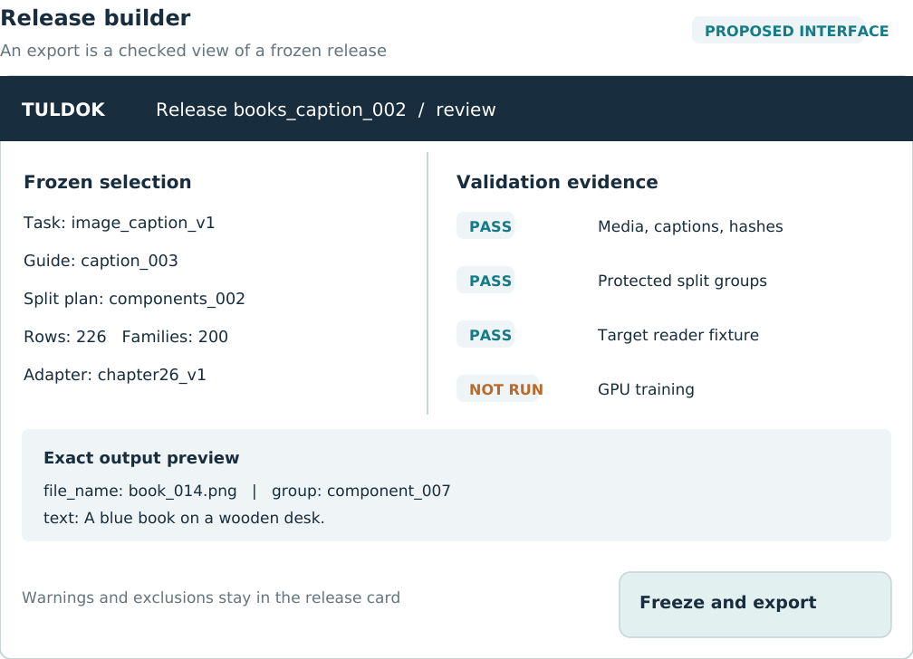

A comparison view lists added, removed, and changed examples, changed splits, and affected model runs. Re-exporting a frozen release uses its recorded adapter revision. New adapters produce new export identities without pretending the source release changed.

Evaluation errors return with model/run and release IDs. The reviewer classifies the cause and creates a precise next task: correct label, collect real examples, repair extraction, review a negative, amend schema, or run a targeted generation preview. This makes Tuldok a learning loop rather than a one-way synthetic-data factory.

These are proposed verticals for brainstorming. They are not an approved delivery sequence, time estimate, or commitment to a particular implementation framework. An urgent model project may change the order, but it should not bypass the release and verification foundation.

## Option A Make the existing task reproducible

Keep the corner workflow visible and familiar. Add source-use notes, decoded-pixel identity, append-only annotation revisions, protected family relationships, release preview, and a manifest. Register the current export as a versioned legacy adapter.

The acceptance gate is concrete: old data still open with correct legacy orientation; stale edits fail; a past release remains identifiable; derivatives retain source families; critical split conflicts block new releases; and the export is not represented as a full backup. This option reduces risk for every later task.

## Option B Add classification and captions

Add two inspectors and exact chapter 8/chapter 26 adapters. Reuse import, gallery, normalization, job queue, and reviewed suggestions. Test fewer than two classes, missing or empty class directories, caption failures, duplicate pixels, unassigned splits, and cross-family leakage. A generated prompt must never be automatically promoted to an accepted caption.

This is the strongest first expansion because it exercises multi-task assets without introducing a new media type. It also gives the companion book immediately useful dataset workflows.

## Option C Add structured text and decisions

Introduce document/text assets, conversations, target-token preview, SFT/CPT adapters, retrieval judgments, and option-pointer records. Retain multiple relevant passages, stable option IDs, and independent calibration. Add preference review as an honest export-only extension until a pinned DPO consumer exists.

Tool trajectories need schema snapshots, explicit simulated/executed observations, assistant-ending export, and outcome validation before a generic log importer is advertised. The acceptance gate is the exact reader and fixture, not the number of editors added.

## Option D Add masks and audio when their editors justify it

For masks, compare a native raster/polygon editor with a tested CVAT round trip. Start with binary-mask export because it feeds both companion vision projects. Direct boxes require an explicit supported reader. Test 0/255 mask encoding, holes, empty masks, EXIF orientation, boundary coordinates, and image/mask transforms, including rotation-compatible batch shapes.

For audio, add waveform segmentation, transcript review, consent and grouping, and source-to-canonical preparation. A Label Studio adapter may be a faster initial annotation route. Keep ASR and waveform generation as distinct tasks with distinct validation.

## Later options should answer measured needs

Pagination, incremental job status, external workers, columnar caches, object storage, collaborative review, access control, and distributed processing may become worthwhile. Profile the actual workload and define the user problem first. A plugin marketplace or cluster scheduler is not required to validate the first caption dataset.

The long-term product idea is coherent: one local-first source and evidence system, several task-aware editors, and explicit adapters. The decision to make now is which complete vertical demonstrates that idea with the least risk. A small, verified release for a real training task is more informative than a broad interface whose exports have never met a loader.

# Appendix A Exact training companion contracts

These are source-inspected contracts for the 2 October 2026 companion edition of *Training Your Own Models on One 24 GB GPU*. They are concrete examples of how general dataset methods meet a real reader. They do not claim that a Tuldok exporter exists or that these readers were executed during this research. A compatible-looking format still needs fixture, loader, batch, and model-runtime checks.

## Internally generated numeric projects

The companion's first model internally generates two numeric features, x1 and x2, and a binary y. The four-sensor project internally generates temperature_c, vibration_mm_s, load_fraction, and age_months, with machine groups and synthetic binary/continuous outcomes. Its remaining-hours-style target is educational, not a physical remaining-life model. Neither unchanged program exposes an external CSV/JSONL importer. [B01, B02]

A Tuldok table editor could preserve feature order, units, machine ID, observation and outcome times, missingness, target definition, and split. External-data use would require a deliberate companion loader extension. Do not advertise a ready-to-train CSV for a program that never reads it.

For genuine predictive data, record when each feature and outcome became available and the prediction horizon. Fit imputers, scalers, and target encodings on training data only. Missing target is not class zero. These tabular lessons belong in a general production system even if its first practical deliverables are images and text.

## Classification folder contract

Chapter 8 reads parts/{train,val,test}/{class_name}/... through an ImageFolder-style layout. The trainer requires at least two classes, with the same class directories in every split; each class folder must contain an image under the ImageFolder defaults. The adapter can materialize that tree while a sidecar manifest maps paths to canonical IDs, hashes, annotation revisions, and family assignments. This is immediately compatible in principle with the reader; actual compatibility still requires running its fixture and loader checks. [B03]

## Geometry and binary masks

Tuldok's point coordinates use x/(W-1), y/(H-1) in the oriented image. The one-object detector derives box edges from masks as xmin/W, ymin/H, (xmax+1)/W, (ymax+1)/H. The maximum edge is exclusive. Both are normalized, but they encode different spaces. [T02, B04]

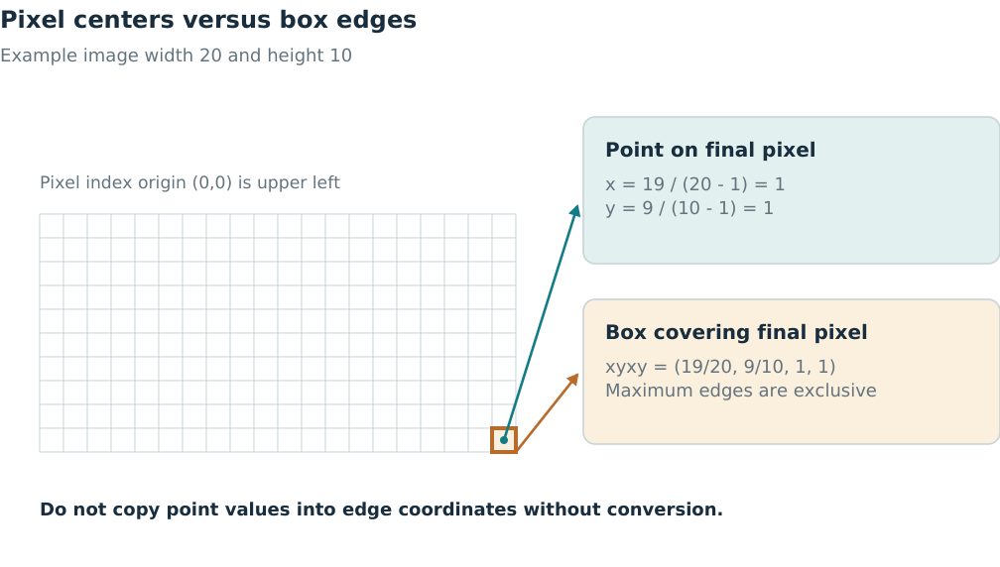

For a 20 by 10 image, the final pixel center is at integer coordinates (19,9), so its point normalization is (1,1). A one-pixel box covering that pixel has normalized half-open edges (19/20,9/10,20/20,10/10). Copying point coordinates into a box field collapses or shifts the region. Store dimensions and convention with every geometry and test boundary pixels explicitly.

A book quadrilateral can be rasterized only under a defined target such as the full book quadrilateral. It is not automatically a visible-object mask when the book is occluded, irregular, open, or contains holes in the desired region. A surrounding axis-aligned box loses orientation and includes background. Mark conversions as derived labels with a transform and review policy.

The mask editor needs brush/erase, polygon-to-raster preview, holes, zoom/pan, opacity, class/instance semantics, and original-image alignment. A promptable model such as SAM 2 can suggest masks, but acceptance needs a declared boundary-checking policy. Missing objects and incorrect holes are easy to overlook at thumbnail scale. [R64]

## The companion detector consumes masks

Chapter 9 reads PNG images and matching single-channel PNG masks with values 0 and 255 in root/{train,val,test}/images and masks, plus manifest.json with max_objects=1. The loader rejects other mask values. It resizes the RGB model input to 96 by 96, but derives the normalized box from the original-size aligned mask. It computes one objectness label and one box per example. Empty masks mean no object and localization loss is masked out. Disconnected foreground regions are merged into one enclosing box by the helper, so the exercise requires at most one object. It does not currently consume COCO, YOLO, or arbitrary box JSONL. [B04]

A direct box adapter would therefore need a deliberate loader adaptation. The workbench should expose this boundary instead of naming any ZIP “detector ready.” Chapter 10's segmenter uses aligned images and single-channel PNG masks encoded as 0/255. Its threshold is greater than 127, so a common 0/1 PNG mask silently becomes all background. It does not resize in its loader and applies joint random 90-degree rotations; even equal rectangular inputs can swap height and width within a batch. Use square, batch-compatible fixtures or deliberately adapt augmentation and collation. Its educational 128 by 128 fixture does not justify distorting all real images to that size. [B05]

## Text and supervised conversation contracts

Chapter 11 of the companion book reads train.txt, validation.txt, and test.txt as UTF-8 byte sequences plus a manifest. Its original generator separates entities before making related fact/question text. A Tuldok exporter should retain document/entity boundaries canonically, record separator rules, and emit file hashes and byte counts. It should not concatenate everything first and randomly split bytes afterward. [B06]

Chapter 20's cpt mode reads JSONL with source_id and text, appends EOS, and supervises all tokens while retaining document separation. The inspected trainer has no production cross-document packing system. Token IDs and packed tensors should therefore be derived caches tied to a tokenizer and packing recipe, never the only surviving corpus. [B08]

LoRA, QLoRA, and full-weight updates are training procedures, not three different annotation types. Chapters 18, 19, and 21 share a loader that expects source_id and messages, optionally tools. Every row ends with one target assistant turn. The actual tokenizer chat template renders the prefix and complete conversation; the program checks the token boundary, masks context labels, and rejects overlength examples rather than silently truncating the answer. [B08]

This gives Tuldok a concrete export preview: raw conversation, rendered template, token count, supervised-token highlight, and the exact model/tokenizer/template revision. A template change must not overwrite the canonical conversation. Related rewrites and paraphrases retain the same source family and split.

Chapter 22's companion generator expands a conversation into one record per target assistant turn after source groups have been assigned. Its lookup_part examples use a structured part_id matching the P-000 pattern and stock/location observations. The unchanged trainer consumes assistant-ending prefixes rather than arbitrary raw logs. A call-target row and an answer-target row can share the same source family while presenting different supervised turns. [B08]

Observations remain context, not invented assistant targets. A separate evaluation should exercise the model's own calls through a bounded mock executor and check the final outcome. Teacher-forced success on gold transcripts alone cannot establish closed-loop tool reliability.

## Retrieval and preferences

The companion's chapter 16 is narrower than a general triple store. It expects corpus.jsonl with doc_id, text, group, split; queries.jsonl with query_id, text, relevant_doc_ids, split; and train_pairs.jsonl with query, positive, doc_id, group. Positive text must exactly match the referenced training document. It uses positive pairs and in-batch negatives, with at most one pair per distinct document in a batch. An explicit hard-negative field is a proposed extension, not an input the current trainer reads. [B07]

The searchable corpus may include permitted held-out documents because those are present at inference; held-out query judgments still do not train the weights. This evaluates a different claim from generalization to a future unseen corpus. The export card must say which claim applies. The Qwen companion's query instruction is added once to queries and not to documents, so the platform must not double-prefix it.

Chapter 25 presents prompt/chosen/rejected message structures as a preference-optimization extension. The inspected companion does not deliver a DPO trainer. Tuldok could prepare and validate this data for a separately pinned compatible consumer, but the interface should label that adapter export-only until the consumer is integrated and tested. It must not imply that train_small_lm.py already runs DPO. [B10]

## Typed decisions and the option pointer

The training book distinguishes proprietary Jev/RLCD, the open Kev implementation, CLM, and Laya. It does not present them as one interchangeable chatbot architecture. Kev uses a joint state/candidate pointer-style readout; CLM independently encodes state and candidates; Laya's typed yes/no, choice, and ordinal outputs are connected to confidence and act/escalate decisions. The book's runnable educational capstone is an original Qwen3-0.6B option-pointer exercise, not a reproduction of those systems. [B09, B14]

A shared workbench can still represent useful ingredients: instructions, typed state or evidence, a bounded question, stable option IDs, constraints, a verified target or sourced target distribution, a source family, and a rubric. Keep hard feasibility constraints distinct from a preference among feasible actions. Keep model confidence distinct from permission to act.

Produce cases from captured or generated states, enumerate allowed candidates, obtain targets from a reviewed policy or oracle, validate feasibility, add hard distractors, and create counterfactuals. Some counterfactuals should preserve the answer; others should change it because a meaningful condition changed. Replacing names while keeping everything else fixed offers weak diversity.

The capstone requires id, group, state, question, options, and label. options contains 2 to 32 objects with stable string id and text. label points to an option ID, not its current integer position. Prediction records may omit it. The files are train.jsonl, dev.jsonl, calibration.jsonl, and test.jsonl. Candidate shuffling must preserve the target by ID. [B09]

Preserve semantic yes/no identities and ordinal order. Test option reordering, misleading descriptions, absent evidence, invalid candidates, all-options-wrong cases, and unseen scenario families. Where the application defines abstention or review, include it explicitly; otherwise retain unresolved cases for review rather than forcing a false correct option.

A target distribution needs provenance. Human disagreement, measured outcome frequencies, and teacher beliefs mean different things. A scalar confidence score without its calibration population and method is weak evidence. Use development data for selection, calibration data for the defined confidence stage, and the untouched test for the final claim.

## Image caption export

Chapter 26 expects root/{train,val,test}/metadata.jsonl with PNGs beside each split's metadata. Fields are file_name, text, and group. Its validator rejects empty captions, missing groups, cross-split group reuse, non-normalized EXIF orientation, and exact decoded-pixel duplicates, and warns when the short side is below 512 pixels. The worked native-1024 fixture is procedural artwork, not proof of broad style learning. [B11]

This contract fits a first caption workspace: show the image, proposed caption, factuality checklist, source/recipe, related variants, and accept/edit/ambiguous actions. A generation prompt remains separate even when it initially supplies a caption candidate. Record requested versus actual size/seed, provider and model revision where available, returned metadata, input references, request identity, and accepted output hash. A seed alone does not guarantee reproduction across service or model changes.

## ASR source and preparation roles

Chapter 27's source JSONL requires id, audio, text, language, speaker_id, session_id, source_id, domain, split, consent, and rights. Source paths are relative to the source manifest's directory unless absolute. Consent must be true and rights nonempty; these fields are assertions checked by the starter, not legal verification. It requires train, validation, and test, with independent speaker/session/source groups. At least three independent consenting speaker groups are necessary for that protocol. [B12]

Preparation converts WAV inputs to mono 16 kHz PCM16 and writes canonical files with source/canonical SHA-256, original rate/channels, duration, RMS, and peak information. The bounded project accepts 0.2 to 8 second clips and rejects records whose synthetic_fixture metadata flag is truthy. This metadata guard does not detect tones or synthetic speech acoustically. Empty-transcript silence probes belong in evaluation for this starter, not its training split. Copying a recording's full transcript onto every short clip is invalid.

Portability requires care. The existing preparation script resolves paths and writes local absolute paths for its local run. Tuldok should export the source contract for that script or explicitly implement and test a relocatable preparation adaptation. Copying a prepared manifest to a different machine is not automatically portable. The release preview should identify source-manifest paths, canonical output paths, and which stage the consumer expects.

## Fixed waveform generation

Chapter 28's DDPM expects mono PCM16 WAV at 16,000 Hz with exactly 8,192 samples, or 0.512 seconds. manifest.csv contains path, label, split, group, source, rights, and sha256. The implemented labels are thump, ping, and hiss, and split names are train, val, and test. The loader checks paths, hashes, group isolation, format, and near-full-scale clipping. [B13]

This is class-conditioned waveform generation, not arbitrary text-to-audio or ASR. Changing the class vocabulary, duration, or sample rate changes the trainer contract. The same asset player can support it, but its inspector should show sound class, sample count, clipping, and listening review instead of transcript controls. An undesirable sound can be excluded or assigned a deliberately defined class; it is not automatically a universal negative sample.

## Readiness map

This map is based on inspected source for the 2 October 2026 companion edition. Compatible format means an adapter can target the existing reader; it does not mean a Tuldok adapter has been implemented or tested.

| Project | Exact existing input | Consumer boundary |
|---|---|---|
| Ch 1 first model | Internally generated x1, x2, y | External import requires loader extension |
| Ch 4 sensor model | Internally generated fixed four features and machine groups | External import requires loader extension; four split roles |
| Ch 8 classification | train/val/test class folders | At least two matching classes; each folder nonempty |
| Ch 9 one-object detector | Images and single-channel 0/255 PNG masks; max_objects=1 | RGB input resized to 96 by 96; box from original mask; no box JSON reader |
| Ch 10 segmentation | Aligned images and single-channel 0/255 PNG masks | No resize; 90-degree rotations need square compatible batches or adaptation |
| Ch 11 tiny language model | UTF-8 train/validation/test text and manifest | Retain source/entity boundaries before rendering |
| Ch 16 embeddings | corpus, queries, train_pairs JSONL | Positive pairs and in-batch negatives; explicit hard negatives need extension |
| Ch 18-22 language tuning | source_id plus messages/tools or CPT text | SFT: actual template and last-assistant target. CPT: all document tokens. No silent truncation. |
| Ch 24 option pointer | id/group/state/question/options/label | 2-32 stable option IDs; train/dev/calibration/test |
| Ch 25 preferences | Conceptual prompt/chosen/rejected | No delivered DPO trainer; separate consumer required |
| Ch 26 image generation | Split metadata.jsonl with file_name/text/group and PNGs | Caption, EXIF, pixel-duplicate and group checks |
| Ch 27 recognition | Source JSONL then prepared canonical audio | Source/prepared path roles differ; synthetic_fixture is a metadata guard |
| Ch 28 waveform DDPM | Fixed WAV format and manifest.csv | Only implemented classes; 16 kHz and 8,192 samples |

# Appendix B Production tools and edition boundaries

Tool choice should follow the bottleneck. A mature specialist editor may save months of mask or waveform work; a distributed pipeline may add more burden than value for a small local collection. Keep canonical IDs, revisions, rights, splits, and releases under the project's control, and integrate other tools through explicit import/export or job contracts.

The following status is a research snapshot checked on 2 October 2026. Pin a version or commit, inspect its exact license and dependencies, and run a representative trial before adopting it. Software licenses do not cover imported datasets, model checkpoints, or inference endpoint terms.

## Annotation and inspection candidates

| Tool | Strong fit | License and edition boundary |
|---|---|---|
| CVAT Community | Precision boxes, polygons, masks, and video annotation | Current Community repository is MIT. Serverless model assets can have separate restrictions. Automated quality control is documented for Online/Enterprise, not promised here for Community. |
| FiftyOne | Visual slicing, similarity inspection, evaluation, and CVAT round trips | Apache-2.0 core; enterprise collaboration is separate. Best considered an analysis sidecar. |
| Label Studio Community | Fast text, audio, and multimodal annotation prototypes | Apache-2.0 core. Templates and import/export are available; role-based review, granular RBAC, and some advanced interfaces have paid-edition boundaries. |
| Argilla | Text, RAG, and preference-review pilot | Apache-2.0. Official repository says original authors moved on, new features are not planned, and bug fixes/patches continue. Review long-term ownership before making it critical. |

Evidence: [R65], [R66], [R67], [R68], [R69], [R70], and [R71].

A trial should include a difficult example and a round trip, not only a demo task. Check stable IDs, class/instance semantics, ignored regions, transcript timing, reviewer identity, and lossless return of edits. If a tool omits a field the canonical schema needs, preserve it in a sidecar mapping rather than silently discard it.

## Interchange and versioning candidates

| Tool | Strong fit | License and operational boundary |
|---|---|---|
| Hugging Face Datasets | Arrow/Parquet, streaming, map/filter, and trainer adapters | Apache-2.0 library. Dataset licenses are independent; fingerprints are cache identities, not review or rights records. |
| Datumaro | Format conversion, merging, and vision checks | Current repository is MIT. Geometry/ontology round trips still need tests because conversion can lose information. |
| DVC | Reproducible batch dependencies and artifact versions alongside code | Apache-2.0; repository now redirects to treeverse/dvc. A lockfile records resolved dependencies, parameters, and hashes, not adjudication. |
| lakeFS | Object-store branches and commits for large shared collections | Current main is BUSL-1.1. README describes free unmodified internal production use and later Apache conversion; review exact version and use terms. Optional for a later scale need. |
| Croissant | Portable dataset metadata | A metadata vocabulary rather than an annotation, storage, or verification engine. |

Evidence: [R72], [R59], [R73], [R74], [R75], [R76], [R77], and [R78].

JSONL plus referenced media is a good inspectable starting point. Parquet becomes useful for larger structured workloads; object-store versioning becomes useful when multiple large versions and teams justify it. Neither should block the first reliable caption release.

## Curation and synthesis candidates

| Tool | Strong fit | License and maturity boundary |
|---|---|---|
| DataTrove | Text extraction, filtering, deduplication, and resumable batch pipelines | Apache-2.0. Useful published examples; likely unnecessary for a small local dataset. |
| NeMo Curator | GPU-oriented text, image, video, and audio curation | Apache-2.0 core. Runtime and model assets vary; adopt after profiling an expensive stage. |
| NeMo Data Designer | Schema-oriented generation, factor/seed sampling, validators, and previews | Apache-2.0 library. Distinct from microservice and endpoint terms. NVIDIA Build documentation restricts evaluation/testing use and excludes confidential/personal data. |
| IBM DiGiT | Seed expansion and transformations with interchangeable teachers | Apache-2.0. A useful candidate runner with validators and telemetry; preserve project-owned IDs and schemas. |
| Distilabel | Existing synthesis and judging workflows that fit a concrete task | Apache-2.0. Original authors moved on; community collaborators maintain it and are preparing a release. Pin a tested version and retain a replacement path. |

Evidence: [R79], [R80], [R81], [R82], [R83], [R84], and [R85].

Compare a small existing-provider adapter with DiGiT or Data Designer on the same seeds and validators. Measure accepted-example cost, failure recovery, privacy routing, provenance fidelity, and maintenance burden. Raw generations per second should be secondary. These tools are research candidates, not installed or benchmarked recommendations for this particular machine.

# Appendix C Example schemas and export relationships

The following records are illustrative. IDs, content, and hashes are placeholders for demonstration; they are not real user data or complete executable training fixtures. Canonical records are proposed Tuldok objects, while the named companion views follow the inspected reader fields. Complete releases also need valid media, split files, hashes, and consumer-specific manifests.

## A canonical example envelope

The envelope keeps task and supervision separate from source storage. Review/rights/group details can be referenced rather than duplicated into every training row.

```json
{
  "example_id": "ex_book_014",
  "revision_id": "rev_003",
  "task": "image_caption_v1",
  "inputs": [{"asset_id": "asset_014"}],
  "target": {"text": "A blue book on a wooden desk."},
  "input_origin": "observed",
  "target_origin": "model_proposed_human_edited",
  "review_event_id": "review_027",
  "family_ids": ["book_B", "session_04"],
  "rights_record_id": "rights_008"
}
```

The vocabulary is a proposal. A production schema should define allowed enums and make model proposal, human edit, and acceptance separate events instead of relying only on the combined origin string shown here.

## Image caption companion view

The adapter maps a frozen example to one row of the appropriate split's metadata.jsonl, with the PNG beside it. group must represent the protected component required by the release policy. [B11]

```json
{"file_name":"book_014.png", "text":"A blue book on a wooden desk.",
 "group":"component_007"}
```

## SFT companion view

This row ends with the target assistant turn. The source_id links related variants for split protection. A real exporter must use the exact message/tool representation supported by the selected tokenizer and trainer. [B08]

```json
{"source_id":"manual_03_question_02",
 "messages":[
   {"role":"user", "content":"Note: Check the seal before use. Summarize."},
   {"role":"assistant", "content":"Check the seal before use."}
 ]}
```

The note is part of the model input, so the target can be checked against it. The canonical conversation remains separate from tokenizer rendering; the export preview shows exactly which assistant tokens receive loss.

## Typed option pointer companion view

The label refers to a stable option ID. Reordering options must not change its semantic target. [B09]

```json
{"id":"decision_014", "group":"scenario_07",
 "state":"The part is unavailable and a substitute needs review.",
 "question":"Which next step is permitted?",
 "options":[
   {"id":"review", "text":"Request substitute review"},
   {"id":"ship", "text":"Ship an unapproved substitute"}
 ],
 "label":"review"}
```

This is an invented bounded policy example. Real policy targets require a source and reviewer; plausible wording is not enough to establish the correct action.

## Release and adapter declaration

A proposed manifest can reference immutable rows and separate the split map and file inventory. Hashes below are descriptive placeholders, not valid digests.

```json
{
  "release_id": "books_caption_002",
  "task_contract": "image_caption_v1",
  "example_revisions": ["rev_003", "rev_009"],
  "split_plan": "split_002",
  "quality_report": "audit_005",
  "rights_review": "use_review_004",
  "adapter": "chapter26_imagefolder_v1",
  "consumer": "Training Your Own Models chapter 26",
  "file_inventory": "files_and_sha256.jsonl",
  "validation": {"data_contract": "not_run", "model_runtime": "not_run"}
}
```

Defaulting validation to not_run is deliberate. The application should change status only after recording a real run and result. A design example must never look like proof of successful training.

# Appendix D Worksheets and release review

## A measurement worksheet

Write one sentence for the deployment task and another for the intended generalization claim. Name the target construct, annotation rule, reviewer expertise, uncertain cases, and prohibited inferences. Identify what the chosen metrics miss. List critical slices and the unit of independence. State which data are for development, calibration, and final evaluation.

## A comparison worksheet

Specify the baseline and intervention before running the experiment. Record the data population, selection rule, accepted examples, independent families, tokens or hours, training budget, seed policy, evaluator, primary outcome, critical regressions, and uncertainty calculation. Distinguish a cheaper pipeline from a better model; either can be valuable, but they answer different questions.

## A synthetic verification worksheet

For each generated target, identify which evidence could prove it wrong. If the answer is only another model's opinion, say so. Record a random accepted-sample audit, targeted hard cases, rejected-sample inspection, diversity by source family, and the limits of executable tests. Decide what happens when checks disagree before seeing the preferred outcome.

## A small end to end exercise

Take a rights-cleared image collection and define a single-label classification task with at least two classes. Freeze a guide, annotate a pilot, compare independent judgments, and revise unclear rules. Assign protected source/session families before augmentation. Measure class and capture-condition coverage. Preserve uncertain cases rather than forcing labels.

Create two equal-budget training selections: a random/stratified baseline and a targeted selection motivated by a documented gap. Keep an untouched real evaluation set. Export the actual class folders, reopen the emitted images, and inspect the loader's first batch. Train only when the data checks pass. Compare utility, slice regressions, review effort, and the number of independent families, not only total rows. A later caption view can reuse the sources while keeping a separate target contract.

## Release checklist

Use this as a starting point for a task-specific checklist, not a universal legal or quality certification.

- Task and target are explicit; unknown, absent, negative, rejected, and uncertain are distinct
- Source rights and intended use are reviewed; external processing and voice use have their own scope
- Originals, derivatives, annotations, and recipes have stable IDs and traceable relationships
- Protected family components were assigned before expansion, with calibration/test roles preserved
- Raw, canonical, perceptual, and semantic duplicate checks are used appropriately and reviewed
- Model proposals remain distinguishable from accepted labels and independent reviews
- Synthetic targets have meaningful verification; executed and simulated outcomes are not confused
- Random audit and targeted review are reported separately, with independent-family denominators
- The exact target loader accepts a positive fixture and rejects important invalid fixtures
- Geometry, loss masks, transcript boundaries, and option IDs are checked in the emitted representation
- Release revisions, splits, versions, hashes, exclusions, and limitations are frozen and documented
- Corrections and withdrawal have an impact path across descendants, exports, and known model runs
- Passed, failed, and not-run validations are reported honestly

# References and evidence notes

The public sources below are primary papers, official documentation, dataset cards, or source repositories. Research was checked on 2 October 2026. Numeric examples labeled original or illustrative are teaching calculations, not measured vendor or model performance. A moving main branch or latest documentation is not a pinned implementation dependency. Source inspection and published claims do not establish runtime success in a new project.

## Public research and tools

**[R01] Measurement and Fairness.** Abigail Z Jacobs and Hanna Wallach. 2021. Relevant evidence: Sections 1-3, especially 3.1 and 3.2 with validity subtypes. [Open source](https://arxiv.org/html/1912.05511v3)

**[R02] Computing Krippendorff's Alpha Reliability.** Klaus Krippendorff. 2011. Relevant evidence: Pages 1-5 including general definition, nominal/multiple-observer/missing-data and metric cases; literature updated 2013. [Open source](https://www.asc.upenn.edu/sites/default/files/2021-03/Computing%20Krippendorff's%20Alpha-Reliability.pdf)

**[R03] Dealing with Disagreements Looking Beyond the Majority Vote in Subjective Annotations.** Aida Mostafazadeh Davani, Mark Diaz, Vinodkumar Prabhakaran. 2022. Relevant evidence: Method framing and sections 5-8, particularly 6.2 limitations and ethics. [Open source](https://aclanthology.org/2022.tacl-1.6.pdf)

**[R04] Confident Learning Estimating Uncertainty in Dataset Labels.** Curtis G Northcutt, Lu Jiang, Isaac L Chuang. 2021. Relevant evidence: PDF sections 2, 3.1, 3.2, theory framing and Appendix B; HTML partial conversion was insufficient. [Open source](https://arxiv.org/pdf/1911.00068)

**[R05] Pervasive Label Errors in Test Sets Destabilize Machine Learning Benchmarks.** Curtis G Northcutt, Anish Athalye, Jonas Mueller. 2021. Relevant evidence: Sections 3-6, tables 1-2, failure modes 4.1, appendices B-D and F. [Open source](https://arxiv.org/html/2103.14749v4)

**[R06] lakeFS Data Retention.** lakeFS Treeverse. current Data Retention guide. [Open source](https://docs.lakefs.io/data-retention/)

**[R07] Tulu 3: Pushing Frontiers in Open Language Model Post-Training.** Lambert et al.. 2024. Relevant evidence: Sections on SFT synthesis/decontamination, preference collection, on-policy and prompt ablations. [Open source](https://arxiv.org/html/2411.15124v1)

**[R08] Active Learning for Convolutional Neural Networks A Core Set Approach.** Ozan Sener and Silvio Savarese. 2018. Relevant evidence: Sections 4.2-4.4 and experimental setup. [Open source](https://arxiv.org/html/1708.00489)

**[R09] Deep Batch Active Learning by Diverse Uncertain Gradient Lower Bounds.** Jordan T Ash and colleagues. 2020. Relevant evidence: Sections 2-4 and discussion; algorithm 1 and gradient-embedding derivation. [Open source](https://arxiv.org/html/1906.03671v2)

**[R10] Deep Learning on a Data Diet Finding Important Examples Early in Training corrected version.** Mansheej Paul, Surya Ganguli, Gintare Karolina Dziugaite. 2023. Relevant evidence: Correction note; sections 2-4; highest-score and extreme-pruning failure cases. [Open source](https://arxiv.org/html/2107.07075v2)

**[R11] Does Deep Learning on a Data Diet reproduce Overall yes but GraNd at Initialization does not.** Andreas Kirsch. 2023. Relevant evidence: Full short reproduction report. [Open source](https://arxiv.org/html/2303.14753)

**[R12] Active Testing Sample Efficient Model Evaluation.** Jannik Kossen, Sebastian Farquhar, Yarin Gal, Tom Rainforth. 2021. Relevant evidence: Sections 2.2-3, 5.1-5.2 and bias illustrations. [Open source](https://proceedings.mlr.press/v139/kossen21a/kossen21a.pdf)

**[R13] DoReMi Optimizing Data Mixtures Speeds Up Language Model Pretraining.** Sang Michael Xie and colleagues. 2023. Relevant evidence: Sections 2-4, algorithm 1, compute discussion and limitations section 6. [Open source](https://arxiv.org/html/2305.10429v4)

**[R14] Scaling Data Constrained Language Models.** Niklas Muennighoff and colleagues. 2023. Relevant evidence: Main experimental framing, sections 5-7, repeated-token comparisons, appendix Q limitations. [Open source](https://arxiv.org/html/2305.16264)

**[R15] Curriculum Learning.** Yoshua Bengio, Jerome Louradour, Ronan Collobert, Jason Weston. 2009. Relevant evidence: Sections 1-3 including distribution-weighting definition. [Open source](https://ronan.collobert.com/pub/2009_curriculum_icml.pdf)

**[R16] On The Power of Curriculum Learning in Training Deep Networks.** Guy Hacohen and Daphna Weinshall. 2019. Relevant evidence: Method framing, scoring/pacing discussion and experimental comparison/cross-validation setup. [Open source](https://proceedings.mlr.press/v97/hacohen19a/hacohen19a.pdf)

**[R17] Data Shapley Equitable Valuation of Data for Machine Learning.** Amirata Ghorbani and James Zou. 2019. Relevant evidence: Section 2 axioms/proposition and section 3.1 Monte Carlo/truncation. [Open source](https://proceedings.mlr.press/v97/ghorbani19c/ghorbani19c.pdf)

**[R18] Self Instruct Aligning Language Models with Self Generated Instructions.** Yizhong Wang and colleagues. 2023. Relevant evidence: Sections 2-3, generation/filtering steps and table 2 author quality audit. [Open source](https://arxiv.org/html/2212.10560)

**[R19] WizardLM Empowering Large Pre Trained Language Models to Follow Complex Instructions.** Can Xu and colleagues. 2023. Relevant evidence: Section 3.1-3.2 instruction evolution and elimination. [Open source](https://arxiv.org/html/2304.12244)

**[R20] Magpie Alignment Data Synthesis from Scratch by Prompting Aligned LLMs with Nothing.** Zhangchen Xu and colleagues. 2024. Relevant evidence: Sections 2, 3.1-3.4 including template generation, filter metrics and historical hardware/time costs. [Open source](https://arxiv.org/html/2406.08464)

**[R21] Lets Verify Step by Step.** Hunter Lightman and colleagues. 2023. Relevant evidence: Section 2.1-2.6 and section 3 comparator caveats. [Open source](https://arxiv.org/html/2305.20050)

**[R22] Self Refine Iterative Refinement with Self Feedback.** Aman Madaan and colleagues. 2023. Relevant evidence: Method and sections 3.1-3.3 metrics/main table. [Open source](https://arxiv.org/html/2303.17651v2)

**[R23] Large Language Models Cannot Self Correct Reasoning Yet.** Jie Huang and colleagues. 2024. Relevant evidence: Section 3 setup, oracle versus intrinsic stopping, tables 2-6 and analysis. [Open source](https://arxiv.org/html/2310.01798)

**[R24] Judging LLM as a Judge with MT Bench and Chatbot Arena.** Lianmin Zheng and colleagues. 2023. Relevant evidence: Sections 3.3-3.4 bias and mitigation; benchmark framing. [Open source](https://arxiv.org/html/2306.05685)

**[R25] Scaling Laws for Reward Model Overoptimization.** Leo Gao, John Schulman, Jacob Hilton. 2023. Relevant evidence: Methodology sections 2.1-2.2 and result framing. [Open source](https://arxiv.org/html/2210.10760)

**[R26] AI models collapse when trained on recursively generated data.** Ilia Shumailov and colleagues. 2024. Relevant evidence: Main/theoretical setup, definition, tail-loss intuition, repetition ablation, discussion; corrected version. [Open source](https://www.nature.com/articles/s41586-024-07566-y)

**[R27] Author Correction AI models collapse when trained on recursively generated data.** Ilia Shumailov and colleagues. 2025. Relevant evidence: Correction text published 2025-03-21. [Open source](https://www.nature.com/articles/s41586-025-08905-3)

**[R28] Is Model Collapse Inevitable Breaking the Curse of Recursion by Accumulating Real and Synthetic Data.** Matthias Gerstgrasser and colleagues. 2024. Relevant evidence: Sections 2.1 and 3 analytical setting; accumulation/replacement definitions and compute note. [Open source](https://arxiv.org/html/2404.01413)

**[R29] Kubric: A scalable dataset generator.** Greff et al.. 2022. Relevant evidence: Sections 3 and data/annotation exports. [Open source](https://arxiv.org/html/2203.03570)

**[R30] Domain Randomization for Transferring Deep Neural Networks from Simulation to the Real World.** Tobin et al.. 2017. Relevant evidence: Sections III-IV. [Open source](https://arxiv.org/html/1703.06907)

**[R31] HOTA: A Higher Order Metric for Evaluating Multi-Object Tracking.** Luiten et al.. 2020. Relevant evidence: Introduction, preliminaries, metric construction. [Open source](https://arxiv.org/html/2009.07736)

**[R32] Improving Image Generation with Better Captions.** OpenAI Betker and colleagues. Improving Image Generation with Better Captions 2023; abstract. [Open source](https://cdn.openai.com/papers/dall-e-3.pdf)

**[R33] pyannote.audio 2.1 speaker diarization pipeline: principle, benchmark, and recipe.** Bredin. 2023. Relevant evidence: Sections 2.1-2.2. [Open source](https://www.isca-archive.org/interspeech_2023/bredin23_interspeech.pdf)

**[R34] WhisperX: Time-Accurate Speech Transcription of Long-Form Audio.** Bain et al.. 2023. Relevant evidence: Sections 2.1-2.6. [Open source](https://arxiv.org/html/2303.00747)

**[R35] Emilia Pipe official preprocessing repository.** Amphion OpenMMLab. main; preprocessors/Emilia README; pipeline and TODOs. [Open source](https://github.com/open-mmlab/Amphion/tree/main/preprocessors/Emilia)

**[R36] Emilia dataset access terms and usage notes.** Amphion. Emilia-Dataset current card; Terms of Access and Notes. [Open source](https://huggingface.co/datasets/amphion/Emilia-Dataset)

**[R37] Qwen3 Embedding Advancing Text Embedding and Reranking Through Foundation Models.** Qwen Team. arXiv 2506.05176 v1; section 3 and appendix A. [Open source](https://arxiv.org/html/2506.05176v1)

**[R38] Nemotron Embedding Model Fine Tuning Recipe.** NVIDIA NeMo. main; docs/nemotron/embed README; Hard-Negative Mining. [Open source](https://github.com/NVIDIA-NeMo/Nemotron/blob/main/docs/nemotron/embed/README.md)

**[R39] UltraFeedback Curated dataset card.** Argilla. ultrafeedback-curated; Introduction. [Open source](https://huggingface.co/datasets/argilla/ultrafeedback-curated)

**[R40] tau-bench: A Benchmark for Tool-Agent-User Interaction in Real-World Domains.** Yao et al.. 2024. Relevant evidence: Introduction, section 3 environment and task construction. [Open source](https://arxiv.org/html/2406.12045)

**[R41] Training Software Engineering Agents and Verifiers with SWE-Gym.** Pan et al.. 2024. Relevant evidence: Introduction, table 1, scaffold and environment construction. [Open source](https://arxiv.org/html/2412.21139)

**[R42] Domino Discovering Systematic Errors with Cross Modal Embeddings.** Sabri Eyuboglu and colleagues. 2022. Relevant evidence: Sections 3-6; error-aware mixture model; 6.1 representation ablation; appendix A.5.1 and A.5.2. [Open source](https://arxiv.org/html/2203.14960v3)

**[R43] Dataset Cartography Mapping and Diagnosing Datasets with Training Dynamics.** Swabha Swayamdipta and colleagues. 2020. Relevant evidence: Sections 2-5; equations for confidence/variability; table 2; figure 3 and optimization counterexample. [Open source](https://arxiv.org/html/2009.10795v2)

**[R44] Understanding Black Box Predictions via Influence Functions.** Pang Wei Koh and Percy Liang. 2017. Relevant evidence: Section 2 derivation including upweighting/removal and test-loss derivative; assumptions; applications framing. [Open source](https://proceedings.mlr.press/v70/koh17a/koh17a.pdf)

**[R45] Influence Functions in Deep Learning Are Fragile.** Samyadeep Basu, Phillip Pope, Soheil Feizi. 2021. Relevant evidence: Sections 4-6, 5.3 setup, 5.4 ImageNet caveats, discussion of reference retraining. [Open source](https://arxiv.org/html/2006.14651v2)

**[R46] Revisiting the Fragility of Influence Functions.** Jacob R Epifano and colleagues. 2023. Relevant evidence: Sections 4.1-4.4; rank-correlation and retraining critique; comparison with Basu. [Open source](https://arxiv.org/html/2303.12922)

**[R47] Estimating Training Data Influence by Tracing Gradient Descent.** Garima Pruthi, Frederick Liu, Satyen Kale, Mukund Sundararajan. 2020. Relevant evidence: Sections 3.1-3.3, 4.1 evaluation setup, 4.4 distinction from influence functions. [Open source](https://papers.neurips.cc/paper/2020/file/e6385d39ec9394f2f3a354d9d2b88eec-Paper.pdf)

**[R48] WILDS A Benchmark of in the Wild Distribution Shifts.** Pang Wei Koh and colleagues. 2021. Relevant evidence: Benchmark framing, domain/subpopulation definitions, dataset protocols including camera/location examples. [Open source](https://proceedings.mlr.press/v139/koh21a/koh21a.pdf)

**[R49] Underspecification Presents Challenges for Credibility in Modern Machine Learning.** Alexander D'Amour and colleagues. 2022. Relevant evidence: Framing and evaluation methods, especially shifted and contrastive evaluations on pp 5-7. [Open source](https://jmlr.org/papers/volume23/20-1335/20-1335.pdf)

**[R50] DataComp-LM: In search of the next generation of training sets for language models.** Li et al.. 2024. Relevant evidence: Sections 3-5, tables 3-5, appendix I table 15. [Open source](https://arxiv.org/html/2406.11794v3)

**[R51] FineWeb-Edu classifier model card.** Hugging Face. 2024. Relevant evidence: Training, metrics, limitations. [Open source](https://huggingface.co/HuggingFaceFW/fineweb-edu-classifier/blob/main/README.md)

**[R52] FineWeb: decanting the web for the finest text data at scale.** Hugging Face. 2024. Relevant evidence: FineWeb-Edu annotation, classifier, filtering and results. [Open source](https://huggingfacefw-blogpost-fineweb-v1.static.hf.space/index.html)

**[R53] FineWeb-Edu dataset card and changelog.** Hugging Face. 2025. Relevant evidence: Dataset description, curation, changelog, licensing. [Open source](https://huggingface.co/datasets/HuggingFaceFW/fineweb-edu)

**[R54] Tulu 3: The next era in open post-training.** Allen Institute for AI. 2024. Relevant evidence: Training stages, release description. [Open source](https://allenai.org/blog/tulu-3-technical)

**[R55] SAM 2: Segment Anything in Images and Videos.** Ravi et al.. 2024. Relevant evidence: Section 5.1-5.2 tables 1-2, appendix E.2.2 and training data. [Open source](https://arxiv.org/html/2408.00714)

**[R56] Granary: Speech Recognition and Translation Dataset in 25 European Languages.** Koluguri et al.. 2025. Relevant evidence: Sections 2-4 tables 1-3. [Open source](https://arxiv.org/html/2505.13404)

**[R57] Granary dataset card.** NVIDIA. 2026. Relevant evidence: Dataset components, schema, statistics, licenses. [Open source](https://huggingface.co/datasets/nvidia/Granary/blob/main/README.md)

**[R58] Everyone wants to do the model work not the data work Data Cascades in High Stakes AI.** Nithya Sambasivan and colleagues. 2021. Relevant evidence: Study method and sampling on pp 3-4, limitations, findings 4.1-4.3. [Open source](https://storage.googleapis.com/gweb-research2023-media/pubtools/5936.pdf)

**[R59] Hugging Face Datasets cache and fingerprints.** Hugging Face. Datasets The cache; fingerprints. [Open source](https://huggingface.co/docs/datasets/about_cache)

**[R60] MLCommons Croissant working group.** MLCommons. Croissant working group; Purpose and Key Terms. [Open source](https://mlcommons.org/working-groups/data/croissant/)

**[R61] MrScripty/Tuldok.** Tuldok repository. Repository identity or pinned commit. [Open source](https://github.com/MrScripty/Tuldok)

**[R62] 2fc4a46.** Tuldok repository. Repository identity or pinned commit. [Open source](https://github.com/MrScripty/Tuldok/commit/2fc4a46f12d73a0fa467d5482f68edb83d6df6af)

**[R63] 7d7e6e6.** Tuldok repository. Repository identity or pinned commit. [Open source](https://github.com/MrScripty/Tuldok/commit/7d7e6e63acc947b3d567add678ce27b2aec373a2)

**[R64] Meta Segment Anything Model 2 research page.** Meta FAIR. SAM 2; Our approach and Dataset. [Open source](https://ai.meta.com/research/sam2/)

**[R65] CVAT Community repository.** CVAT AI. develop/default branch; License section. [Open source](https://github.com/cvat-ai/cvat)

**[R66] CVAT Quality Control documentation.** CVAT AI. Quality control; availability badge. [Open source](https://docs.cvat.ai/docs/qa-analytics/quality-control/)

**[R67] FiftyOne core license.** Voxel51. main LICENSE; Apache License 2.0. [Open source](https://github.com/voxel51/fiftyone/blob/main/LICENSE)

**[R68] FiftyOne CVAT integration.** Voxel51. FiftyOne 1.22.1 documentation; CVAT Integration. [Open source](https://docs.voxel51.com/integrations/cvat.html)

**[R69] Label Studio Community repository.** HumanSignal. develop; README and LICENSE. [Open source](https://github.com/HumanSignal/label-studio)

**[R70] Compare Label Studio Editions.** HumanSignal. Compare Label Studio Editions; feature matrix. [Open source](https://labelstud.io/guide/label_studio_compare)

**[R71] Argilla repository and maintenance notice.** Argilla. develop; Important notice and License. [Open source](https://github.com/argilla-io/argilla)

**[R72] Hugging Face Datasets repository.** Hugging Face. main; README and LICENSE. [Open source](https://github.com/huggingface/datasets)

**[R73] Datumaro repository.** Open Edge Platform. develop; README. [Open source](https://github.com/open-edge-platform/datumaro)

**[R74] Datumaro license.** Open Edge Platform Intel. develop LICENSE; MIT. [Open source](https://github.com/open-edge-platform/datumaro/blob/develop/LICENSE)

**[R75] DVC repository.** Treeverse DVC. main; Copyright section; iterative redirect. [Open source](https://github.com/treeverse/dvc)

**[R76] DVC yaml and lock file documentation.** DVC. dvc.yaml Files; dvc.lock section. [Open source](https://s.dvc.org/user-guide/project-structure/dvcyaml-files)

**[R77] lakeFS repository and current license summary.** Treeverse lakeFS. main; License summary. [Open source](https://github.com/treeverse/lakeFS)

**[R78] Croissant format documentation.** MLCommons. Croissant format overview; 1.0 example. [Open source](https://docs.mlcommons.org/croissant/)

**[R79] DataTrove repository.** Hugging Face. main; README and LICENSE. [Open source](https://github.com/huggingface/datatrove)

**[R80] NeMo Curator repository.** NVIDIA NeMo. main; README and LICENSE. [Open source](https://github.com/NVIDIA-NeMo/Curator)

**[R81] NeMo Curator documentation.** NVIDIA NeMo. Latest v1.3.0 26.07; Welcome. [Open source](https://docs.nvidia.com/nemo/curator/latest/home/welcome)

**[R82] NeMo Data Designer repository.** NVIDIA NeMo. main; License, Telemetry and privacy. [Open source](https://github.com/NVIDIA-NeMo/DataDesigner)

**[R83] NeMo Data Designer library versus microservice deployment.** NVIDIA NeMo. current Deployment Options. [Open source](https://docs.nvidia.com/nemo/datadesigner/concepts/deployment-options)

**[R84] DiGiT official repository.** IBM. main; README and LICENSE. [Open source](https://github.com/IBM/fms-dgt)

**[R85] Distilabel repository and maintenance notice.** Argilla Distilabel community. main; Important notice and License. [Open source](https://github.com/argilla-io/distilabel)

## Tuldok source evidence

T01-T09 refer to main at 2fc4a46f12d73a0fa467d5482f68edb83d6df6af. T10-T12 refer to the integration branch at 7d7e6e63acc947b3d567add678ce27b2aec373a2. Code and tests were inspected, not run for this research.

**[T01] README.md.** Current scope, workflow, coordinate conventions, split behavior, provider distinctions, tests, explicit absence of selected distribution license. [Pinned source](https://github.com/MrScripty/Tuldok/blob/2fc4a46f12d73a0fa467d5482f68edb83d6df6af/README.md)

**[T02] app.py.** Dataset schema (114–154), split resolver (159–173), import and source preservation (175–218), deletion/revisions (220–278), suggestions (280–300), current export (302–329), HTTP endpoints/default local binding (333–460). [Pinned source](https://github.com/MrScripty/Tuldok/blob/2fc4a46f12d73a0fa467d5482f68edb83d6df6af/app.py)

**[T03] static/index.html.** Current three-pane HTML interface, fixed corner-label controls, camera/import/generation controls. [Pinned source](https://github.com/MrScripty/Tuldok/blob/2fc4a46f12d73a0fa467d5482f68edb83d6df6af/static/index.html)

**[T04] static/app.js.** Collection/editor/save workflow, unsaved protection, local settings, suggestion application, generation refresh and one-second polling. [Pinned source](https://github.com/MrScripty/Tuldok/blob/2fc4a46f12d73a0fa467d5482f68edb83d6df6af/static/app.js)

**[T05] synthetic.py.** Persistent job/entry JSON tables, batched prompt generation, exact prompt deduplication, single sequential worker, interrupted/cancelled/failed/resumed states. [Pinned source](https://github.com/MrScripty/Tuldok/blob/2fc4a46f12d73a0fa467d5482f68edb83d6df6af/synthetic.py)

**[T06] ai.py.** Hard-coded book-corner output schema, provider catalog, 1600-pixel image preparation, coordinate identity transformation, provider/model/timestamp provenance. [Pinned source](https://github.com/MrScripty/Tuldok/blob/2fc4a46f12d73a0fa467d5482f68edb83d6df6af/ai.py)

**[T07] tests/test_dataset.py.** Source tests for EXIF preservation, grouped splits, stale saves/deletes, negative/hidden labels, geometry, legacy corner references, exact duplicates and deletion recovery. [Pinned source](https://github.com/MrScripty/Tuldok/blob/2fc4a46f12d73a0fa467d5482f68edb83d6df6af/tests/test_dataset.py)

**[T08] tests/test_synthetic.py.** Source tests for prompt preparation, generation lifecycle, cancellation/resume, persistent entries, duplicate images and deleted generated outputs. [Pinned source](https://github.com/MrScripty/Tuldok/blob/2fc4a46f12d73a0fa467d5482f68edb83d6df6af/tests/test_synthetic.py)

**[T09] tests/browser.cjs.** Browser fixture assertions for camera, corner interaction, zoom, rotation, AI unsaved suggestions, keys, negative examples, export and narrow layout. [Pinned source](https://github.com/MrScripty/Tuldok/blob/2fc4a46f12d73a0fa467d5482f68edb83d6df6af/tests/browser.cjs)

**[T10] README.md.** Integration-branch Pumas VLM discovery, width/height defaults, no generation duration deadline, uncertain outcome after lost response; branch-specific, not default-branch capability. [Pinned source](https://github.com/MrScripty/Tuldok/blob/7d7e6e63acc947b3d567add678ce27b2aec373a2/README.md)

**[T11] ai.py.** Integration branch adds Pumas provider routing and shares structured book-corner supervision semantics. [Pinned source](https://github.com/MrScripty/Tuldok/blob/7d7e6e63acc947b3d567add678ce27b2aec373a2/ai.py)

**[T12] image_generation.py.** Integration branch provider-contract image-generation request handling and dimension/metadata behavior. [Pinned source](https://github.com/MrScripty/Tuldok/blob/7d7e6e63acc947b3d567add678ce27b2aec373a2/image_generation.py)

## Training book companion evidence

The inspected companion is the 2 October 2026 edition of Training Your Own Models on One 24 GB GPU. The assembled Markdown SHA-256 is fe2692ca2ae38be2eb7d7d3741a46560187502595cf5a10bca99c0a0c9236843. Paths below are reader-facing paths inside its companion project, not web links. No new GPU or model-runtime validation was performed for this dataset research.

**[B01] Chapter 1: Train your first model before learning the whole field.** Two features x1/x2; binary target; fixed synthetic generation; no external data loader. Companion files: examples/first-model/train.py; examples/first-model/README.md.

**[B02] Chapter 4: Turn four sensor readings into a useful prediction.** Fixed feature order and units, machine grouping, internal data generation, train/calibration/validation/test allocation. Companion files: examples/tiny-ml/train_tabular.py.

**[B03] Chapter 8: Classify your own small image collection.** Class-folder input tree, same class directories by split, synthetic fixture boundary. Companion files: examples/tiny-ml/train_image_classifier.py; examples/tiny-ml/make_classification_data.py; examples/tiny-ml/README.md.

**[B04] Chapter 9: Locate one object with a box.** Actual mask-pair loader, max_objects=1 manifest requirement, exclusive-maximum normalized boxes, negative images. Companion files: examples/tiny-ml/train_detector.py; examples/tiny-ml/detector_common.py.

**[B05] Chapter 10: Predict a mask then extract an outline.** Aligned PNG/mask structure, binary target, no loader resize, joint augmentation, holes and outlines. Companion files: examples/tiny-ml/train_segmenter.py; examples/tiny-ml/make_shapes.py; examples/tiny-ml/contours.py.

**[B06] Chapter 11: Train a miniature language model from random weights.** UTF-8 byte files, entity-separated related text, source/seed/hash manifest. Companion files: examples/tiny-transformer/make_data.py; examples/tiny-transformer/train.py.

**[B07] Chapter 16: Make related text easy to retrieve.** Three-file corpus/query/pair contract, positive identity and split checks, in-batch supervision, query formatting. Companion files: examples/embeddings/make_retrieval_data.py; examples/embeddings/train_embeddings.py; examples/embeddings/embedding_contract.py; examples/embeddings/retrieval_common.py.

**[B08] Chapters 18–22: SFT, full training, CPT, style and tools.** source_id plus messages/tools or text; assistant-ending expansion, actual chat-template and loss-mask checks, no silent truncation, held-out tool expected_call. Companion files: examples/llm/make_data.py; examples/llm/train_small_lm.py; examples/llm/generate_eval.py; examples/llm/score_tools.py.

**[B09] Chapter 24: From a language model to a decision model.** id/group/state/question/options/label fields, 2–32 options, ID-based target remapping, independent dev/calibration/test roles. Companion files: examples/decision_pointer/decision_pointer.py; examples/decision_pointer/make_toy_data.py; examples/decision_pointer/README.md.

**[B10] Chapter 25: Preferences and distillation.** Prompt/chosen/rejected conceptual contract; offline sequence distillation; no delivered DPO trainer in the inspected companion. Companion files: output/training-your-own-models.md.

**[B11] Chapter 26: Teach an image generator a small visual style.** file_name/text/group imagefolder contract; orientation, pixel duplicate, group and caption validation. Companion files: examples/diffusion/make_image_cards.py; examples/diffusion/check_image_data.py; examples/diffusion/train_image_lora.sh.

**[B12] Chapter 27: Speech recognition.** Required source-manifest fields, three-way speaker/session/source isolation, consent/rights assertion, 0.2–8 s clip preparation and source/canonical hashes. Companion files: examples/asr/prepare_audio.py; examples/asr/README.md; examples/asr/train_qwen_asr.py.

**[B13] Chapter 28: Build a tiny sound generator from random weights.** Manifest columns; mono PCM16 16 kHz/8192-sample data; thump/ping/hiss classes; group/hash/path checks. Companion files: examples/diffusion/make_tiny_sfx.py; examples/diffusion/tiny_audio_ddpm.py; examples/diffusion/audio_run_integrity.py.

**[B14] Chapters 23–24: Laya, Jev/Kev/CLM studies and original Qwen capstone.** Book distinguishes architecture studies and reported upstream findings from its original educational implementation. Companion files: output/training-your-own-models.md.

## Reading the design claims

All proposed schemas, screen controls, release gates, tool integrations, and additive options are recommendations derived from the evidence. They are not existing features. The figures are original explanatory diagrams and interface concepts. Illustrative calculations, counts, records, waveforms, and identifiers do not describe real user data. The case-study reconstructions distinguish disclosed stages and measurements from original interpretation and proposed local experiments.
